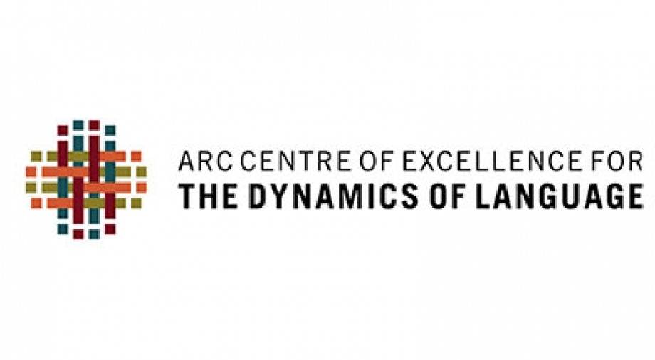

The LADAL team organizes workshops and LADAL members present their research or information relevant to LADAL at conferences. Below are links to upcoming events (conferences/workshops/presentations) and persentations containing information about LADAL or research based on LADAL. 

*** 

# UPCOMING{-}

*** 

### LADAL Opening Event{-}

The opening event signifies the official kick off for LADAL. Originally this kick-off was planned for June 2020 as a 5-day conference with an invited speaker ([Stefan Gries](http://www.stgries.info/)), workshops on data science, and social events. Unfortunately, this kick-off had to be postponed due to COVID19 and will be held as an online event.

Here you will find updates and the current state of plans relating to the LADAL opening. 

*** 

# PAST EVENTS/PRESENTATIONS{-}

***

### Best Practices in Corpus Linguistics – What lessons should we take from the Replication Crisis and how can we guarantee high quality in our research?{-}

Speaker: Martin Schweinberger

```{r ws1, echo=FALSE, out.width= "75%", out.extra='style="float:right; padding:15px"'}
knitr::include_graphics("images/icame41heidelberg.png")
```


Date: 20–24 May 2020

Presentation at ICAME 41 (41th Meeting of the International Computer Archive of Modern and Medieval English). Heidelberg, Germany.

Materials: [slides](http://martinschweinberger.de/docs/ppt/schweinberger-ppt-heidelberg-2020-05-21.pdf), [video](http://martinschweinberger.de/docs/materials/SchweinbergerBestPractices_ICAME41.mp4)

**Abstract**: This paper addresses issues relating to best practices in Data Management and Data Analysis in Corpus Linguistics (CL) and offers guidelines for compiling, storing, handling, and analysing data according to best practices which guarantee transparency and high quality in CL. 

Open Data and Best Practices in Data Science are increasingly attracting attention as a result of the so-called Replication Crisis (RC) which is an ongoing methodological crisis primarily affecting parts of the social and life sciences that began in the early 2010s (Diener & Biswas-Diener 2019). The RC has contributed to the loss of trust that the Humanities and Social Science have been experienced over the past two decades (Yong 2018). While a discussion about Best Practices in CL has recently begun (Berez-Kroeker et al. 2018) more attention has to be placed on the causes of the RC and the lessons that can be learnt from it. 

CL is somewhat disjunct from current developments in Data Science due to a lack of communication and unawareness of existing resources. This talk aims to raise awareness in CL about existing resources and problematic practices that are still common in CL, and it proposes solutions that are easily implemented and can guarantee transparency, replicability, and high quality of research outputs in CL. 

The solutions that this talk focuses on encompass 

*	being aware and following the FAIR principles (Findable, Accessible, Interoperable, and Reusable) in data management; 

*	the recognition of corpora as research outputs which allows corpora to be uniquely indexed (DOIs) and thereby enabling corpus compilers to profit from making corpora accessible as these can be cited like other publications which increases citation scores and visibility;

*	the use of Git to share code and data which is an easy way to share resources free of charge by utilizing existing research infrastructure;

* the use of R Notebooks to document analyses and making them available to the community and reviewers to enable full replicability and reproducibility;

*	making use of documentation and policy protocols in departments, schools and institutes to ease onboarding procedures and prevent data loss and corruption. 

The talk thus offers relevant information for authors as well as editors and publishers to enable replication, avoid “bad” research practices, and increase the quality of research.

**References**

Berez-Kroeker, A. L., L. Gawne, S. S. Kung, B. F. Kelly, T. Heston, G. Holton, P. Pulsifer, D. I. Beaver, S. Chelliah, S. Dubinsky, et al. (2018). Reproducible research in linguistics: A position statement on data citation and attribution in our field. *Linguistics* 56(1), 1–18. 

Diener, Edward and Biswas-Diener, Robert (2019). The Replication Crisis in Psychology. [NOBA Project]( https://nobaproject.com/modules/the-replication-crisis-in-psychology).

Yong, Ed (2018). Psychology’s Replication Crisis Is Running Out of Excuses. Another big project has found that only half of studies can be repeated. And this time, the usual explanations fall flat. [The Atlantic](https://www.theatlantic.com/science/archive/2018/11/psychologys-replication-crisis-real/576223/).

***

### Implementing school-based support infrastructure for digital humanities research at UQ - The Language Technology and Data Analysis Laboratory (LADAL){-}

```{r ws2, echo=FALSE, out.width= "50%", out.extra='style="float:right; padding:15px"'}
knitr::include_graphics("images/ardcskilledworkforce.png")
```

Date: 30 October 2019
 
Speaker: Michael Haugh & Martin Schweinberger

Presentation at the Australian Research Data Commons (ARDC): The Australian eResearch Skilled Workforce Summit. Sydney, Australia, 29-30/7/2019.

Materials: [slides](http://martinschweinberger.de/docs/ppt/HaughSchweinberger_eResearchSummit_20190730.pptx)

**Abstract**: This presentation introduces the Language Technology and Data Analysis Laboratory (LADAL), and discusses the implications of our experiences to date in establishing it for broader efforts to develop researcher capacity in the digital humanities. 

The LADAL is school-based support infrastructure for digital humanities researchers. It aims to assist staff and postgraduate students within the UQ School of Languages and Cultures to learn how to use data analytics, digital research tools, and other forms of technology to enhance their existing research programs, as well as offer pathways to new research possibilities. It complements the more generic resources and training in digital humanities methods offered by libraries (e.g. the Digital Scholars Hub at UQ) with the more specialised training/support in particular digital research methods and technologies that are required by researchers working on specific languages and cultures. 

The LADAL consists of a specialist computing lab for language-based computational and experimental work (the Computational and Experimental Workshop) and an online virtual lab. With respect to web-based materials, the LADAL website (https://slcladal.github.io/index.html) offers self-guided study materials and hands-on tutorials on topics relating to digital tools, computational methods for data extraction and processing, data visualization, statistical analyses of language data, and provides links to further resources and short descriptions of digital tools relevant for digital HASS research. 
In addition, the LADAL offers face-to-face consultations and specialized workshops. UQ researchers are encouraged to contact LADAL staff for advice and guidance on matters relating to digital research tools, data visualization, various statistical procedures, and text analytics. 

Staff feedback during face-to-face consultations and workshop attendance confirms there is substantial demand for the kind of digital humanities infrastructure offered by LADAL. It also suggests that support and training for researchers in the digital humanities should be conceptualized on a continuum from more generic through to more localized support. 

***

### Using R for Corpus Linguistics – an Introduction and Discussion Note on Sustainability and Replicability in Corpus Linguistics{-}

```{r ws3, echo=FALSE, out.width= "40%", out.extra='style="float:right; padding:15px"'}

```

<br>

Date: 2 April 2019
 
Speaker: Martin Schweinberger

Presentation at the *Center of Excellence for the Dynamics of Language (CoEDL) Corpus Workshop*. Melbourne, Australia, 2–3/4/2019.

Materials: [slides](https://slcladal.github.io/resources/.pdf)

*** 

[Main page](https://slcladal.github.io/index.html)

