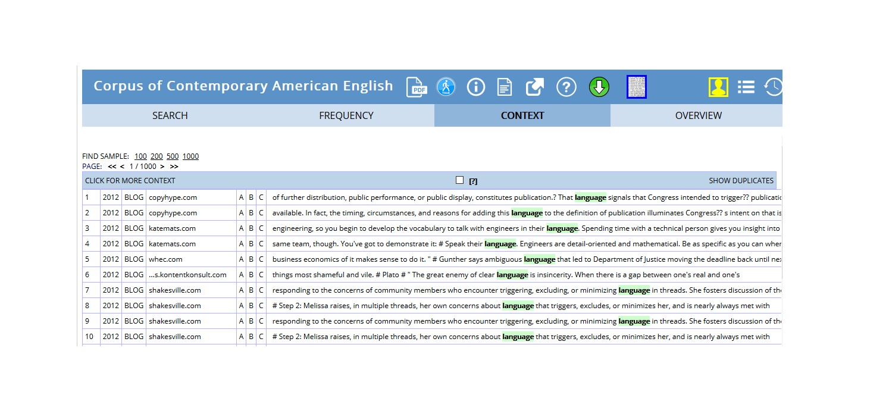

```{r uq1, echo=F, fig.cap="", message=FALSE, warning=FALSE, out.width='100%'}
knitr::include_graphics("images/uq1.jpg")
```

# Introduction{-}

This tutorial introduces how to extract concordances and keyword-in-context (KWIC) displays with R. The entire R-markdown document for the tutorial can be downloaded [here](https://slcladal.github.io/kwics.Rmd).  

In the language sciences, concordancing refers to the extraction of words from a given text or texts [@lindquist2009corpus 5]. Commonly, concordances are displayed in the form of keyword-in-context displays (KWICs) where the search term is shown in context, i.e. with preceding and following words. Concordancing are central to analyses of text and they often represents the first step in more sophisticated analyses of language data [@stafanowitsch2020corpus]. The play such a key role in the language sciences because concordances are extremely valuable for understanding how a word or phrase is used, how often it is used, and in which contexts is used. As concordances allow us to analyze the context in which a word or phrase occurs and provide frequency information about word use, they also enable us to analyze collocations or the collocational profiles of words and phrases [@stafanowitsch2020corpus 50-51]. Finally, concordances can also be used to extract examples and it is a very common procedure. 

```{r antc1, echo=FALSE, out.width= "70%", out.extra='style="float:left; padding:5px"', fig.cap="\\label{fig:Fig1} Concordances in AntConc."}
knitr::include_graphics("images/AntConcConcordance.png")
```


There are various very good software packages that can be used to create concordances - both for offline use (e.g. [*AntConc*](https://www.laurenceanthony.net/software/antconc/) [@anthony2004antconc], [*SketchEngine*](https://www.sketchengine.eu/)[@kilgarriff2004itri], [*MONOCONC*](https://www.monoconc.com/)[@barlow1999monoconc], and [*ParaConc*](https://paraconc.com/))[@barlow2002paraconc] and online use (see e.g. [here](https://lextutor.ca/conc/)). 


In addition, many corpora that are available such as the [BYU corpora](https://corpus.byu.edu/overview.asp) can be accessed via a web interface that have in-built concordancing functions.  
  
```{r coca1, echo=FALSE, out.width= "80%", out.extra='style="float:right; padding:5px"', fig.cap="\\label{fig:Fig2} Online concordances extracted from the COCA corpus that is part of the BYU corpora."}

```

  
While these packages are very user-friendly, offer various additional functionalities, and almost everyone who is engaged in analyzing language has used concordance software, they all suffer from shortcomings that render R a viable alternative. Such issues include that these applications  
  
* are black boxes that researchers do not have full control over or do not know what is going on within the software

* they are not open source

* they hinder replication because the replications is more time consuming compared to analyses based on Notebooks.

* they are commonly not free-of charge or have other restrictions on use (a notable exception is *AntConc*)


R represents an alternative to ready-made concordancing applications because it:

* is extremely flexible and enables researchers to perform their entire analysis in a single environment

* allows full transparency and documentation as analyses can be based on Notebooks

* offer version control measures (this means that the specific versions of the involved software are traceable)

* makes research more replicable as entire analyses can be reproduced by simply running the Notebooks that the research is based on 

Especially the aspect that R enables full transparency and replicability is relevant given the ongoing *Replication Crisis* [@atlantic2018psychology; @fivethirtyeight2018replication; @noba2019replication; @physorg2018replication; @sciencealert2018replication]. The Replication Crisis is a ongoing methodological crisis primarily affecting parts of the social and life sciences beginning in the early 2010s [see also @fanelli2009fraud]. Replication is important so that other researchers, or the public for that matter, can see or, indeed, reproduce, exactly what you have done. Fortunately, R allows you to document your entire workflow as you can store everything you do in what is called a script or a notebook (in fact, this document was originally a R notebook). If someone is then interested in how you conducted your analysis, you can simply share this notebook or the script you have written with that person.

## Preparation and session set up{-}

This tutorial is based on R. If you have not installed R or are new to it, you will find an introduction to and more information how to use R [here](https://slcladal.github.io/IntroR_workshop.html). For this tutorials, we need to install certain *packages* from an R *library* so that the scripts shown below are executed without errors. Before turning to the code below, please install the packages by running the code below this paragraph. If you have already installed the packages mentioned below, then you can skip ahead ignore this section. To install the necessary packages, simply run the following code - it may take some time (between 1 and 5 minutes to install all of the libraries so you do not need to worry if it takes some time).

```{r prep1, echo=T, eval = F}
# clean current workspace
rm(list=ls(all=T))
# set options
options(stringsAsFactors = F)         # no automatic data transformation
options("scipen" = 100, "digits" = 4) # suppress math annotation
# install libraries
install.packages(c("quanteda", "dplyr", "stringr", "knitr", "kableExtra", "gutenbergr"))
```

Once you have installed R-Studio and initiated the session by executing the code shown above, you are good to go.

## Loading and processing textual data{-}

Before creating concordances or kwics, we load the necessary packages from the R library which will help to download, process, and display the data as well as create the concordances.

```{r skwic1, message=FALSE, warning=FALSE}
# activate packages
library(quanteda)
library(dplyr)
library(stringr)
library(knitr)
library(kableExtra)
library(gutenbergr)
```

For this tutorial, we will use Charles Darwin's *On the Origin of Species by means of Natural Selection* which we download from the [Project Gutenberg](https://www.gutenberg.org/) archive [see @stroube2003literary]. Thus, Darwin's *Origin of Species* forms the basis of our analysis. You can use the code below to download this text into R (but you have to have access to the internet to do so).

```{r skwic2}
origin <- gutenberg_works(gutenberg_id == "1228") %>%
  gutenberg_download(meta_fields = "gutenberg_id")
# inspect data
kable(head(origin), caption = "First 6 rows of the text") %>%
  kable_styling(bootstrap_options = "striped", full_width = T, position = "left")
```
The table above shows that Darwin's *Origin of Species* requires formatting so that we can use it. Therefore, we collapse it into a single object (or text) and remove superfluous white spaces.


```{r skwic3}
origin <- origin$text %>%
  paste0(collapse = " ") %>%
  str_squish()
str(origin)
```

The result confirms that the entire text is now combined into a single character object. 

## Creating simple concordances{-}

Now that we have loaded the data, we can easily extract concordances using the `kwic` function from the `quanteda` package. The `kwic` function takes the text (`x`) and the search pattern (`pattern`) as it main arguments but it also allows the specification of the context window, i.e. how many words/elements are show to the left and right of the key word (we will go over this later on).

```{r basekwic2}
kwic_natural <- kwic(x = origin, pattern = "selection")
# inspect data
kable(head(kwic_natural), caption = "First 6 concordances for the keyword *natural*.") %>%
  kable_styling(bootstrap_options = "striped", full_width = T, position = "left")
```

We can easily extract the frequency of the search term (*selection*) using the `nrow` or the `length` functions which provide the number of rows of a tables (`nrow`) or the length of a vector (`length`).

```{r basekwic4}
nrow(kwic_natural)
```


```{r basekwic5}
length(kwic_natural$keyword)
```

The results show that there are 414 instances of the search term (*selection*) but we can also find out how often different variants (lower case versus upper case) of the search term were found using the `table` function. This is especially useful when searches involve many different search terms (while it is, admittedly, less useful in the present example). 

```{r basekwic6}
table(kwic_natural$keyword)
```

To get a better understanding of the use of a word, it is often useful to extract more context. This is easily done by increasing size of the context window. To do this, we specify the `window` argument of the `kwic` function. In the example below, we set the context window size to 10 words/elements rather than using the default (which is 5 word/elements).


```{r basekwic8}
kwic_natural_longer <- kwic(x = origin, pattern = "selection", window = 10)
# inspect data
kable(head(kwic_natural_longer), 
      caption = "First 6 concordances for the keyword *natural* with an extended context (10 elements).") %>%
  kable_styling(bootstrap_options = "striped", full_width = T, position = "left")
```

## Extracting more than single words{-}

While extracting single words is very common, you may want to extract more than just one word. To extract phrases, all you need to so is to specify that the pattern you are looking for is a phrase, as shown below.

```{r multikwic2}
kwic_naturalselection <- kwic(origin, pattern = phrase("natural selection"))
# inspect data
kable(head(kwic_naturalselection), caption = "First 6 concordances for the key phrase *natural selection*.") %>%
  kable_styling(bootstrap_options = "striped", full_width = T, position = "left")
```

Of course you can extend this to longer sequences such as entire sentences. However, you may want to extract more or less concrete patterns rather than words or phrases. To search for patterns rather than words, you need to include regular expressions in your search pattern. 

## Searches using regular expressions{-}

Regular expressions allow you to search for abstract patterns rather than concrete words or phrases which provides you with an extreme flexibility in what you can retrieve. A regular expression (in short also called *regex* or *regexp*) is a special sequence of characters that stand for are that describe a pattern. You can think of regular expressions as very powerful combinations of wildcards or as wildcards on steroids. For example, the sequence `[a-z]{1,3}` is a regular expression that stands for one up to three lower case characters and if you searched for this regular expression, you would get, for instance, *is*, *a*, *an*, *of*, *the*, *my*, *our*, *etc*, and many other short words as results.

There are three basic types of regular expressions:

* regular expressions that stand for individual symbols and determine frequencies

* regular expressions that stand for classes of symbols

* regular expressions that stand for structural properties

The regular expressions below show the first type of regular expressions, i.e. regular expressions that stand for individual symbols and determine frequencies.

```{r regex05, echo=F, eval = T}
symbols1 <- c("?", "\\*", "\\+", "{n}", "{n,}", "{n,m}")
explanation1 <- c("The preceding item is optional and will be matched at most once", "The preceding item will be matched zero or more times", "The preceding item will be matched one or more times", "The preceding item is matched exactly n times", "The preceding item is matched n or more times", "The preceding item is matched at least n times, but not more than m times")
example1 <- c("walk[a-z]? = walk, walks", 
             "walk[a-z]* = walk, walks, walked, walking", 
             "walk[a-z]+ = walks, walked, walking", 
             "walk[a-z]{2} = walked", 
             "walk[a-z]{2,} = walked, walking", 
             "walk[a-z]{2,3} = walked, walking")
df_regex <- data.frame(symbols1, explanation1, example1)
colnames(df_regex) <- c("RegEx Symbol/Sequence", "Explanation", "Example")
kable(df_regex, 
      caption = "Regular expressions that stand for individual symbols and determine frequencies.") %>%
  kable_styling(bootstrap_options = "striped", full_width = T, position = "left")
```

The regular expressions below show the second type of regular expressions, i.e. regular expressions that stand for classes of symbols.

```{r regex03, echo=F, eval = T}
symbols2 <- c("[ab]", "[AB]", "[12]", "[:digit:]", "[:lower:]", "[:upper:]", "[:alpha:]", "[:alnum:]", "[:punct:]", "[:graph:]", "[:blank:]", "[:space:]", "[:print:]")
explanations2 <- c("lower case a and b", 
                   "upper case a and b", 
                   "digits 1 and 2", 
                   "digits: 0 1 2 3 4 5 6 7 8 9", 
                   "lower case characters: a–z", 
                   "upper case characters: A–Z", 
                   "alphabetic characters: a–z and A–Z", 
                   "digits and alphabetic characters", 
                   "punctuation characters: . , ; etc.", 
                   "graphical characters: [:alnum:] and [:punct:]", 
                   "blank characters: Space and tab", 
                   "space characters: Space, tab, newline, and other space characters", 
                   "printable characters: [:alnum:], [:punct:] and [:space:]")
df_regex <- data.frame(symbols2, explanations2)
colnames(df_regex) <- c("RegEx Symbol/Sequence", "Explanation")
kable(df_regex, 
      caption = "Regular expressions that stand for classes of symbols.") %>%
  kable_styling(bootstrap_options = "striped", full_width = T, position = "left")
```

The regular expressions that denote classes of symbols are enclosed in `[]` and `:`. The last type of regular expressions, i.e. regular expressions that stand for structural properties are shown below.

```{r regex09, echo=F, eval = T}
symbols3 <- c("\\\\\\w", "\\\\\\W", "\\\\\\s", "\\\\\\S", "\\\\\\d", "\\\\\\D", "\\\\\\b", "\\\\\\B", "\\\\<", "\\\\>", "^", "$")
explanations3 <- c("Word characters: [[:alnum:]_]",
                   "No word characters: [^[:alnum:]_]",
                   "Space characters: [[:blank:]]",
                   "No space characters: [^[:blank:]]",
                   "Digits: [[:digit:]]",
                   "No digits: [^[:digit:]]",
                   "Word edge",
                   "No word edge",
                   "Word beginning",
                   "Word end",
                   "Beginning of a string",
                   "End of a string")
df_regex <- data.frame(symbols3, explanations3)
colnames(df_regex) <- c("RegEx Symbol/Sequence", "Explanation")
kable(df_regex, 
      caption = "Regular expressions that stand for structural properties.") %>%
  kable_styling(bootstrap_options = "striped", full_width = T, position = "left")
```

To include regular expressions in your KWIC searches, you include them in your search pattern and set the argument `valuetype` to `"regex"`. The search pattern `"\\bnatu.*|\\bselec.*"` retrieves elements that contain `natu` and `selec` followed by any characters and where the `n` in `natu` and the `s` in `selec` are at a word boundary, i.e. where they are the first letters of a word. Hence, our serach would not retrieve words like *unnatural* or *deselect*. The `|` is an operator (like `+`, `-`, or `*`) that stands for *or*.

```{r rkwic6, echo=T, eval = T, message=FALSE, warning=FALSE}
# define search patterns
patterns <- c("\\bnatu.*|\\bselec.*")
kwic_regex <- kwic(origin, patterns, valuetype = "regex")
# inspect data
kable(head(kwic_regex), caption = "First 6 concordances for the regular expression \\bnatu.*.") %>%
  kable_styling(bootstrap_options = "striped", full_width = T, position = "left")
```

## Piping concordances{-}

Quite often, we only want to retrieve patterns if they occur in a certain context. For instance, we might be interested in instances of *selection* but only if the preceding word is *natural*. Such conditional concordances could be extracted using regular expressions but they are easier to retrieve by piping. Piping is done using the `%>%` function from the `dplyr` package and the piping sequence can be translated as *and then*. We can then filter those concordances that contain *natural* using the `filter` function from the `dplyr` package. Note the the `$` stands for the end of a string so that *natural$* means that *natural* is the last element in the string that is preceding the keyword.

```{r pipekwic7, echo=T, eval = T, message=FALSE, warning=FALSE}
kwic_pipe <- kwic(x = origin, pattern = "selection") %>%
  filter(str_detect(pre, "natural$|NATURAL$"))
# inspect data
kable(head(kwic_pipe), caption = "First 6 concordances for instances of *selection* that are preceeded by *natural*.") %>%
  kable_styling(bootstrap_options = "striped", full_width = T, position = "left")
```

Piping is a very useful helper function and it is very frequently used in R - not only in the context of text processing but in all data science related domains.

## Arranging concordances and adding frequency information{-}

When inspecting concordances, it is useful to re-order the concordances so that they do not appear in the order that they appeared in the text or texts but by the context. To reorder concordances, we can use the `arrange` function from the `dplyr` package which takes the column according to which we want to re-arrange the data as it main argument. 

In the example below, we extract all instances of *natural* and then arrange the instances according to the content of the `post` column in alphabetical.

```{r orderkwic2, echo=T, eval = T, message=FALSE, warning=FALSE}
kwic_ordered <- kwic(x = origin, pattern = "natural") %>%
  arrange(post)
# inspect data
kable(head(kwic_ordered), caption = "First 6 re-ordered concordances for instances of *natural*.") %>%
  kable_styling(bootstrap_options = "striped", full_width = T, position = "left")
```

Arranging concordances according to alphabetical properties may, however, not be the most useful option. A more useful option may be to arrange concordances according to the frequency of co-occurring terms or collocates. In order to do this, we need to extract the co-occurring words and calculate their frequency. We can do this by combining the  `mutate`, `group_by`, `n()` functions from the `dplyr` package with the `str_remove_all` function from the `stringr` package. Then, we arrange the concordances by the frequency of the collocates in descending order (that is why we put a `-` in the arrange function). In order to do this, we need to 

1. create a new variable or column which represents the word that co-occurs with, or, as in the example below, immediately follows the search term. In the example below, we use the `mutate` function to create a new column called `post_word`. We then use the `str_remove_all` function to remove everything except for the word that immediately follows the search term (we simply remove everything and including a white space).

2. group the data by the word that immediately follows the search term.

3. create a new column called `post_word_freq` which represents the frequencies of all the words that immediately follow the search term.

4. arrange the concordances by the frequency of the collocates in descending order.

```{r orderkwic4, echo=T, eval = T, message=FALSE, warning=FALSE}
kwic_ordered_coll <- kwic(x = origin, pattern = "natural") %>%
  mutate(post_word = str_remove_all(pre, " .*")) %>%
  group_by(post_word) %>%
  mutate(post_word_freq = n()) %>%
  arrange(-post_word_freq)
# inspect data
kable(head(kwic_ordered_coll), caption = "First 6 re-ordered concordances for instances of *natural*.") %>%
  kable_styling(bootstrap_options = "striped", full_width = T, position = "left")
```

We add more columns according to which we could arrange the concordance following the same schema. For example, we could add another column that represented the frequency of words that immediately preceded the search term and then arrange according to this column.

## Concordances from transcriptions{-}

As many analyses use transcripts as their primary data and because transcripts have features that require additional processing, we will now perform concordancing based on on transcripts. As a first step, we load five example transcripts that represent the first five files from the Irish component of the [International Corpus of English](https://www.ice-corpora.uzh.ch/en.html).

```{r trans2, echo=T, eval = T, message=FALSE, warning=FALSE}
# define corpus files
files <- paste("https://slcladal.github.io/data/ICEIrelandSample/S1A-00", 1:5, ".txt", sep = "")
# load corpus files
transcripts <- sapply(files, function(x){
  x <- readLines(x)
})
# inspect first ten lines of the first transcript
transcripts[[1]][1:10]
```

The first ten lines shown above let us know that, after the header (`<S1A-001 Riding>`) and the symbol which indicates the start of the transcript (`<I>`), each utterance is preceded by a sequence which indicates the section, file, and speaker (e.g. `<S1A-001$A>`). The first utterance is thus uttered by speaker `A` in file `001` of section `S1A`. In addition, there are several sequences that provide meta-linguistic information which indicate the beginning of a speech unit (`<#>`), pauses (`<,>`), and laughter (`<&> laughter </&>`).

To perform the concordancing, we need to change the format of the transcripts because the `kwic` function only works on character, corpus, tokens object- in their present form, the transcripts represent a list which contains vectors of strings. To change the format, we collapse the individual utterances into a single character vector for each transcript.

```{r trans4, echo=T, eval = T, message=FALSE, warning=FALSE}
transcripts_collapsed <- sapply(files, function(x){
  x <- readLines(x)
  x <- paste0(x, collapse = " ")
  x <- str_squish(x)
})
# inspect data
str(transcripts_collapsed)
```

We can now extract the concordances.

```{r trans6, echo=T, eval = T, message=FALSE, warning=FALSE}
kwic_trans <- kwic(x = transcripts_collapsed, pattern = phrase("you know"))
# inspect data
kable(head(kwic_trans), caption = "First 6 concordances for *you know* in three example transcripts.") %>%
  kable_styling(bootstrap_options = "striped", full_width = T, position = "left")
```

The results show that each non-alphanumeric character is counted as a single word which reduces the context of the keyword substantially. Also, the docname column contains the full path to the data which make it hard to parse the content of the table. To address the first issue, we remove symbols by adding `remove_symbols = T` and  remove punctuation by adding `remove_punct = T`. In addition, we clean the docname column and extract only the file name.


```{r trans8, echo=T, eval = T, message=FALSE, warning=FALSE}
kwic_trans <- kwic(x = transcripts_collapsed, pattern = phrase("you know"),
                   remove_symbols = T, remove_punct = T)
# clean docnames
kwic_trans$docname <- kwic_trans$docname %>%
  str_replace_all(".*/([A-Z][0-9][A-Z]-[0-9]{1,3}).txt", "\\1") 
# inspect data
kable(head(kwic_trans), caption = "First 6 concordances for *you know* in three example transcripts.") %>%
  kable_styling(bootstrap_options = "striped", full_width = T, position = "left")
```

We could also extend the context window and merge the symbols that the `kwic` function has separated. 


Extending the context can also be used to identify the speaker that has uttered the search pattern that we are interested in. We will do just that as this is a common task in linguistics analyses.

To extract speakers, we need to follow these steps:

1. Create normal concordances of the pattern that we are interested in.

2. Generate concordances of the pattern that we are interested in with a substantially enlarged context window size.

3. Extract the speakers from the enlarged context window size.

4. Add the speakers to the normal concordances using the `left-join` function from the `dplyr` package.

```{r trans10, echo=T, eval = T, message=FALSE, warning=FALSE}
kwic_normal <- kwic(transcripts_collapsed, phrase("you know"))
kwic_long <- kwic(transcripts_collapsed, phrase("you know"), window = 500) %>%
  mutate(pre = str_remove_all(pre, ".*\\$")) %>%
  mutate(pre = str_remove_all(pre, "\\>.*"),
         speaker = str_squish(pre)) %>%
  select(docname, speaker)
# add speaker to normal kwic
kwic_combined <- left_join(kwic_normal, kwic_long)
# clean docnames
kwic_combined$docname <- kwic_combined$docname %>%
  str_replace_all(".*/([A-Z][0-9][A-Z]-[0-9]{1,3}).txt", "\\1") 
# inspect data
kable(head(kwic_combined), caption = "First 6 concordances for *you know* with speakers that uttered them.") %>%
  kable_styling(bootstrap_options = "striped", full_width = T, position = "left")
```

The resulting table shows that we have successfully extracted the speakers (identified by the letters in the `speaker` column) and cleaned the file names (in the `docnames` column).

## Customizing concordances{-}

As R represents a fully-fledged programming environment, we can, of course, also write our own, customized concordance function. The code below shows how you could go about doing so. Note, however, that this function only works if you enter more than a single file. 

```{r customkwic2}
mykwic <- function(txts, pattern, context) {
  # activate packages
  require(stringr)
  require(plyr)
  # list files
  conc <- sapply(txts, function(x) {
    # determine length of text
    lngth <- as.vector(unlist(nchar(x)))
    # determine position of hits
    idx <- str_locate_all(x, pattern)
    idx <- idx[[1]]
    ifelse(nrow(idx) >= 1, idx <- idx, return("No hits found"))
    # define start position of hit
    token.start <- idx[,1]
    # define end position of hit
    token.end <- idx[,2]
    # define start position of preceding context
    pre.start <- ifelse(token.start-context < 1, 1, token.start-context)
    # define end position of preceding context
    pre.end <- token.start-1
    # define start position of subsequent context
    post.start <- token.end+1
    # define end position of subsequent context
    post.end <- ifelse(token.end+context > lngth, lngth, token.end+context)
    # extract the texts defined by the positions
    PreceedingContext <- substring(x, pre.start, pre.end)
    Token <- substring(x, token.start, token.end)
    SubsequentContext <- substring(x, post.start, post.end)
    conc <- cbind(PreceedingContext, Token, SubsequentContext)
    # return concordance
    return(conc)
    })
  concdf <- ldply(conc, data.frame)
  colnames(concdf)[1]<- "File"
  return(concdf)
}
```

We can now try if this function works by searching for the sequence *you know* in the transcripts that we have loaded earlier. One difference between the `kwic` function provided by the `quanteda` package and the customized concordance function used here is that the `kwic` function uses the number of words to define the context window, while the `mykwic` function uses the number of characters or symbols instead (which is why we use a notably higher number to define the context window).

```{r customkwic4}
myconcordances <- mykwic(transcripts_collapsed, "you know", 50)
# inspect data
kable(head(myconcordances), caption = "First 6 concordances for you know extracted using the mykwic function.") %>%
  kable_styling(bootstrap_options = "striped", full_width = T, position = "left")
```

As this concordance function only works for more than one text, we split the text of Darwin's *On the Origin of Species* into chapters and assign each section a name.


```{r customkwic6}
# read in text
origin_split <- origin %>%
  str_squish() %>%
  str_split(" [0-9]{1,2}\\. ") %>%
  unlist()
origin_split <- origin_split[which(nchar(origin_split) > 2000)]
# add names
names(origin_split) <- paste0("text", 1:length(origin_split))
# inspect data
nchar(origin_split)
```
Now that we have named elements, we can search for the pattern *natural selection*. We also need to clean the concordance as some sections do not contain any instances of the search pattern. To clean the data, we select only the columns `File`, `PreceedingContext`, `Token`, and `SubsequentContext` and then remove all rows where information is missing. 

```{r customkwic8}
natsel_conc <- mykwic(origin_split, "natural selection", 50) 
natsel_conc <- natsel_conc %>%
  select(File, PreceedingContext, Token, SubsequentContext) %>%
  na.omit()
# inspect data
kable(head(natsel_conc), caption = "First 6 concordances for *natural selection* extracted using the mykwic function.") %>%
  kable_styling(bootstrap_options = "striped", full_width = T, position = "left")
```

You can go ahead and modify the customized concordance function to suit your needs. 


# Citation & Session Info {-}

Schweinberger, Martin. 2020. *Concordancing with R*. Brisbane: The University of Queensland. url: https://slcladal.github.io/kwics.html (Version 2020.09.29).

```
@manual{schweinberger2020introqant,
  author = {Schweinberger, Martin},
  title = {Concordancing with R},
  note = {https://slcladal.github.io/kwics.html},
  year = {2020},
  organization = "The University of Queensland, School of Languages and Cultures},
  address = {Brisbane},
  edition = {2020/09/29}
}
```


```{r fin}
sessionInfo()
```

***

[Main page](https://slcladal.github.io/index.html)

***

# References {-}

