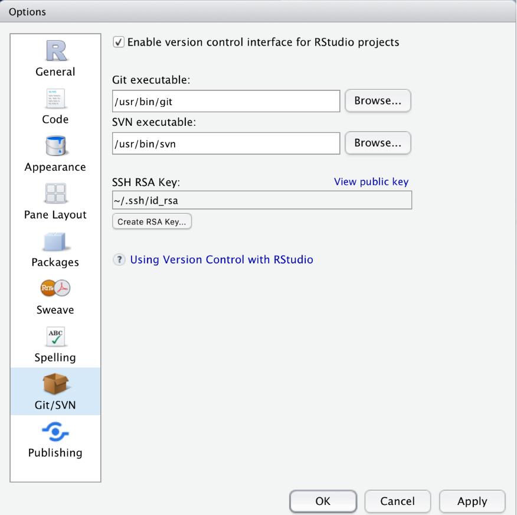

```{r uq1, echo=F, fig.cap="", message=FALSE, warning=FALSE, out.width='100%'}
knitr::include_graphics("images/uq1.jpg")
```

# Introduction{-}

This tutorial introduces lexicography with R and shows how to use R to create dictionaries and find synonyms through determining semantic similarity in R. While the initial example focuses on English, subsequent sections show how easily this approach can be generalized to languages other than English (e.g. German, French, Spanish, Italian, or Dutch). The entire R-markdown document for the sections below can be downloaded [here](https://slcladal.github.io/lex.Rmd).

Traditionally, dictionaries are listing of words that are commonly arranged alphabetically, which may include information on definitions, usage, etymologies, pronunciations, translation, etc. [see @agnes2002webster; @steiner1985dictionaries]. If such dictionaries, that are typically published as books contain translations of words in other languages, they are referred to as lexicons. Therefore, lexicographical references show the inter-relationships among lexical data, i.e. words.

Similarly, in computational linguistics, dictionaries represent a specific format of data where elements are linked to or paired with other elements in a  systematic way. *Computational lexicology* refers to a branch of computational linguistics, which is concerned with the use of computers in the study of lexicons. Hence, computational lexicology has been defined as the use of computers in the study of machine-readable dictionaries  [see e.g. @amsler1981structure]. Computational lexicology is distinguished from *computational lexicography*, which can be defined as the use of computers in the construction of dictionaries which is the focus of this tutorial. It shoule be noted, thought, that computational lexicology and computational lexicography are often used synonymously. 

## Preparation and session set up{-}

This tutorial is based on R. If you have not installed R or are new to it, you will find an introduction to and more information how to use R [here](https://slcladal.github.io/IntroR_workshop.html). For this tutorials, we need to install certain *packages* from an R *library* so that the scripts shown below are executed without errors. Before turning to the code below, please install the packages by running the code below this paragraph. If you have already installed the packages mentioned below, then you can skip ahead ignore this section. To install the necessary packages, simply run the following code - it may take some time (between 1 and 5 minutes to install all of the libraries so you do not need to worry if it takes some time).

```{r prep1, echo=T, eval = F, message=FALSE, warning=FALSE}
# clean current workspace
rm(list=ls(all=T))
# set options
options(stringsAsFactors = F)         # no automatic data transformation
options("scipen" = 100, "digits" = 4) # suppress math annotation
# install libraries
install.packages(c("tidyr", "tidytext", "textdata", "quanteda", "koRpus", 
                   "koRpus.lang.en", "DT", "hunspell", "coop", "dplyr", 
                   "tm", "cluster"))
```

Once you have installed R Studio and initiated the session by executing the code shown above, you are good to go.

# Creating dictionaries

In a first step, we load the necessary packages from the library and define the location of the engine which we use for the part-of-speech tagging. In this case, we will use the TreeTagger [see @schmid1994treetagger; @schmid2007enriched,; @schmid2013probabilistic]. How to install and then use the TreeTagger for English as well as for German, French, Spanish, Italian, and Dutch is demonstrated and explained [here](https://slcladal.github.io/tagging.html#TreeTagger:_pos-tagging_languages_other_than_English).

***

NOTE

You will have to install TreeTagger and change the path used below (`"C:\\TreeTagger\\bin\\tag-english.bat"`) to the location where you have installed TreeTagger on your machine. If you do not know how to install TreeTagger or encounter problems, read [this tutorial](https://slcladal.github.io/tagging.html)!

In addition, you can download the pos-tagged text [here](https://slcladal.github.io/data/orwell.txt) so you can simply skip the next code chunk and load the data as shown below.

***


```{r lex1, message=FALSE, warning=FALSE}
# activate packages
library(tidyr)
library(tidytext)
library(stringr)
library(textdata)
library(quanteda)
library(koRpus)
library(koRpus.lang.en)
library(DT)
library(hunspell)
library(coop)
library(dplyr)
library(tm)
library(cluster)
# define location of pos-tagger engine
set.kRp.env(TT.cmd="C:\\TreeTagger\\bin\\tag-english.bat", lang="en") 
```

In a next step, we load and process the data which in this tutorial represents the text from George Orwell's *Nineteen Eighty-Four*. We will not pre-process the data by for instance repairing broken or otherwise compromised words and continue by directly implementing the part-of-speech tagger.

```{r lex3, eval = F, message=FALSE, warning=FALSE}
# load and pos-tag data
orwell_pos <- treetag("https://slcladal.github.io/data/orwell.txt")
# select data frame
orwell_pos <- orwell_pos@tokens
# inspect  results
datatable(head(orwell_pos, 100), rownames = FALSE, options = list(pageLength = 10, scrollX=T), filter = "none")
```


If you could not pos-tag the text, you can simply execute the following code chunk which loads the pos-tagged text from the LADAL repository.

```{r lex5, echo = T, eval = T, message=FALSE, warning=FALSE}
# load pos-taged data
orwell_pos <- read.delim("https://slcladal.github.io/data/orwell_pos.txt", sep = "\t", header = T)
# inspect  results
datatable(head(orwell_pos, 100), rownames = FALSE, options = list(pageLength = 10, scrollX=T), filter = "none")
```

We can now use the resulting table to generate a first, basic dictionary that holds information about the word form (*token*), the part-of speech tag (*tag*), the lemmatized word type (*lemma*), the general word category (*wclass*), and the frequency with which the word form is used as that part-of speech.

```{r lex7, message=FALSE, warning=FALSE}
# generate dictionary
orwell_dic_raw <- orwell_pos %>%
  dplyr::select(token, tag, lemma, wclass) %>%
  dplyr::group_by(token, tag, lemma, wclass) %>%
  dplyr::summarise(frequency = dplyr::n()) %>%
  dplyr::arrange(lemma)
# inspect  results
datatable(head(orwell_dic_raw, 100), rownames = FALSE, options = list(pageLength = 10, scrollX=T), filter = "none")
```

## Cleaning dictionary entries{-}

However, as the resulting table shows, the data is still very noisy, i.e. it contains a lot of *non-words*, i.e words that may be mis-spelled, broken, or otherwise compromised. In order to get rid of these, we can simply check if the word lemma exists in an existing dictionary. When you aim to identify exactly those words that are not yet part of an established dictionary, you could of course do it the other way around and remove all words that are already present in an existing dictionary.


```{r lex11, message=FALSE, warning=FALSE}
# generate dictionary
orwell_dic_clean <- orwell_dic_raw %>%
  dplyr::filter(hunspell_check(lemma)) %>%
  dplyr::filter(!stringr::str_detect(lemma, "\\W\\w{1,}"))
# inspect  results
datatable(head(orwell_dic_clean, 100), rownames = FALSE, options = list(pageLength = 10, scrollX=T), filter = "none")
```


We have now checked the entries against an existing dictionary and removed non-word elements. As such, we are left with a clean dictionary based on George Orwell's *Nineteen Eighty-Four*. 


## Extending dictionaries{-}

Extending dictionaries, that is adding additional layers of information or other types of annotation, e.g. url's to relevant references or sources,  is fortunately very easy in R and can be done without much additional computing. 

We will begin to extend our dictionary by adding an additional column (called `annotation`) in which we will add information.


```{r ext1, message=FALSE, warning=FALSE}
# generate dictionary
orwell_dic_ext <- orwell_dic_clean %>%
  dplyr::mutate(annotation = NA) %>%
  dplyr::mutate(annotation = ifelse(token == "3rd", "also 3.",
                                    ifelse(token == "4th", "also 4.", annotation)))
# inspect  results
datatable(head(orwell_dic_ext, 10), rownames = FALSE, options = list(pageLength = 10, scrollX=T), filter = "none")
```


To make it a bit more interesting but also keep this tutorial simple and straight-forward, we will add information about the polarity and emotionally of the words in our dictionary. We can do this by performing a sentiment analysis on the lemmas using the `tidytext` package.

The `tidytext` package contains three sentiment dictionaries (`nrc`, `bing`, and `afinn`). For the present purpose, we use the `ncr`dictionary which represents the Word-Emotion Association Lexicon [@@mohammad2013crowdsourcing]. The Word-Emotion Association Lexicon which comprises 10,170 terms, and in which lexical elements are assigned scores based on ratings gathered through the crowd-sourced Amazon Mechanical Turk service. For the Word-Emotion Association Lexicon raters were asked whether a given word was associated with one of eight emotions. The resulting associations between terms and emotions are based on 38,726 ratings from 2,216 raters who answered a sequence of questions for each word which were then fed into the emotion association rating (see @mohammad2013crowdsourcing). Each term was rated 5 times. For 85 percent of words, at least 4 raters provided identical ratings. For instance, the word *cry* or *tragedy* are more readily associated with SADNESS while words such as *happy* or *beautiful* are indicative of JOY and words like *fit* or *burst* may indicate ANGER. This means that the sentiment analysis here allows us to investigate the expression of certain core emotions rather than merely classifying statements along the lines of a crude positive-negative distinction.

To be able to use the Word-Emotion Association Lexicon we need to add another column to our data frame called `word` which simply contains the lemmatized word. The reason is that the lexicon expects this column and only works if it finds a word column in the data. The code below shows how to add the emotion and polarity entries to our dictionary.


```{r ext3, message=FALSE, warning=FALSE}
# generate dictionary
orwell_dic_ext <- orwell_dic_ext %>%
  dplyr::mutate(word = lemma) %>%
  dplyr::left_join(get_sentiments("nrc")) %>%
  tidyr::spread(sentiment, sentiment)
# inspect  results
datatable(head(orwell_dic_ext, 100), rownames = FALSE, options = list(pageLength = 10, scrollX=T), filter = "none")
```

The resulting extended dictionary now contains not only the token, the pos-tag, the lemma, and the generalized word class, but also the emotional and polarity scores from the Word-Emotion Association Lexicon.

## Generating dictionaries for other languages{-}

As mentioned above, the procedure for generating dictionaries can easily be applied to languages other than English. If you want to follow exactly the procedure described above, then the language set of the TreeTagger is the limiting factors as its R implementation only supports English, German, French, Italian, Spanish, and Dutch. fa part-of-speech tagged text in another language is already available to you, and you do not require the TreeTagger for the part-of-speech tagging, then you can skip the code chunk that is related to the tagging and you can modify the procedure described above to virtually any language.

We will now briefly create a German dictionary based on a subsection of the fairy tales collected by the brothers Grimm to show how the above procedure can be applied to a language other than English. In a  first step, we load a German text into R. 


```{r none1, eval = F, echo = F}
grimm <- readLines("data/GrimmsFairytales.txt")# %>%
#  str_replace_all(fixed("u<U+0364>"), "ü") %>%
#  str_replace_all(fixed("a<U+0364>"), "ä") %>%
#  str_replace_all(fixed("<U+017F>"), "s") %>%
#  paste0(sep = " ", collapse = " ") %>%
#  str_squish() %>%
#  str_remove(".*Freimund. Vorrede. ")
str(grimm)

writeLines(grimm, "data/grimm.txt")
```
```{r none3, message=FALSE, warning=FALSE}
# install german language package
#install.koRpus.lang("de")
# activate german language package
library(koRpus.lang.de)
# define location of pos-tagger engine
set.kRp.env(TT.cmd="C:\\TreeTagger\\bin\\tag-german.bat", lang="de") 
```


***

NOTE

You would need to adapt the path to the TreeTagger engine (see previous code chunk) as well as the path to the data (see follwoing code chunk)! The paths below are specified to my computer.

***

```{r none5, message=FALSE, warning=FALSE}
# pos-tag data
grimm_pos <- treetag(file = "data/grimm.txt")
```

For other languages, you would need to adapt the path to the pos-tagger engine to match the language of your text. The code chunk below shows how you would do that for French, Spanish, Italian, and Dutch. Again note that you would need to adapt the path to the TreeTagger engine as well as the path to the data! The paths below are specified to my computer.

```{r none7, eval = F, message=FALSE, warning=FALSE}
# French
# install french language package
install.koRpus.lang("fr")
# activate french language package
library(koRpus.lang.fr)
# define location of pos-tagger engine
set.kRp.env(TT.cmd="C:\\TreeTagger\\bin\\tag-french.bat", lang="fr") 
# pos-tag data
text_pos <- treetag("PathToFrenchText.txt")

# Spanish
# install spanish language package
install.koRpus.lang("es")
# activate spanish language package
library(koRpus.lang.es)
# define location of pos-tagger engine
set.kRp.env(TT.cmd="C:\\TreeTagger\\bin\\tag-spanish.bat", lang="es") 
# pos-tag data
text_pos <- treetag("PathToSpanishText.txt")

# Italian
# install italian language package
install.koRpus.lang("it")
# activate italian language package
library(koRpus.lang.it)
# define location of pos-tagger engine
set.kRp.env(TT.cmd="C:\\TreeTagger\\bin\\tag-italian.bat", lang="it") 
# pos-tag data
text_pos <- treetag("PathToItalianText.txt")

# Dutch
# install dutch language package
install.koRpus.lang("nl")
# activate dutch language package
library(koRpus.lang.nl)
# define location of pos-tagger engine
set.kRp.env(TT.cmd="C:\\TreeTagger\\bin\\tag-dutch.bat", lang="nl") 
# pos-tag data
text_pos <- treetag("PathToDutchText.txt")


```


We will now continue with generating the dictionary based on teh brothers' Grimm fairy tales. We go through the same steps as for the English dictionary and collapse all the steps into a single code block. 


```{r none9, message=FALSE, warning=FALSE}
# select data frame
grimm_pos <- grimm_pos@tokens
# generate dictionary
grimm_dic_raw <- grimm_pos %>%
  dplyr::select(token, tag, lemma, wclass) %>%
  dplyr::group_by(token, tag, lemma, wclass) %>%
  dplyr::summarise(frequency = dplyr::n()) %>%
  dplyr::arrange(lemma)
# clean dictionary
grimm_dic_clean <- grimm_dic_raw %>%
  dplyr::filter(!stringr::str_detect(lemma, "\\W\\w{1,}")) %>%
  dplyr::filter(!stringr::str_detect(lemma, "\\W{1,}")) %>%
  dplyr::filter(!stringr::str_detect(lemma, "[:digit:]{1,}")) %>%
  dplyr::filter(nchar(token) > 1)
# inspect  results
datatable(head(grimm_dic_clean, 100), rownames = FALSE, options = list(pageLength = 10, scrollX=T), filter = "none")
```

As with the English dictionary, we have created a customized German dictionary based of a subsample of the brothers' Grimm fairy tales holding the word form(*token*), the part-of-speech tag (*tag*), the lemmatized word type (*lemma*), the general word class (*wclass*), ad the frequency with which a word form occurs as a part-of-speech in the data (*frequency*).

# Finding synonyms

Another task that is quite common in lexicography is to determine if words share some form of relationship such as whether they are synonyms or antonyms. In computational linguistics, this is commonly determined based on the collocational profiles of words. These collocational profiles are also called *word vectors* or *word embeddings* and approaches which determine semantic similarity based on collocational profiles or word embeddings are called distributional approaches (or distributional semantics). The basic assumption of distributional approaches is that words that occur in the same context and therefore have similar collocational profiles are also semantically similar. In fact, various packages, such as `qdap` or , `wordnet` already provide synonyms for terms (all of which are based on similar collocational profiles) but we would like to determine if words are similar without knowing it in advance. 

In this example, we want to determine if two degree adverbs (such as *very*, *really*, *so*, *completely*, *totally*, *amazingly*, etc.) are synonymous and can therefore be exchanged without changing the meaning of the sentence (or, at least, not changing it dramatically). This is relevant in lexicography as such terms can then be linked to each other and inform readers that these words are interchangeable. 

As a first step, we load the data which contains three columns: 

* one column holding the degree adverbs which is called *pint* 

* one column called *adjs* holding the adjectives that the degree adverbs have modified

* one column called *remove* which contains the word *keep* and which we will remove as it is not relevant for this tutorial

When loading the data, we 

* remove the *remove* column 

* rename the *pint* column as *degree_adverb* 

* rename the *adjs* column as *adjectives*

* filter out all instances where the degree adverb column has the value `0` (which means that the adjective was not modified)
 * remove instances where *well* functions as a degree adverb (because it behaves rather differently from other degree adverbs)
 
```{r syn1, message=FALSE, warning=FALSE}
# load data
degree_adverbs <- read.delim("https://slcladal.github.io/data/data04.txt", sep = "\t", header = T) %>%
  dplyr::select(-remove) %>%
  dplyr::rename(degree_adverb = pint,
                adjective = adjs) %>%
  dplyr::filter(degree_adverb != "0",
                degree_adverb != "well")
# inspect  results
datatable(head(degree_adverbs, 100), rownames = FALSE, options = list(pageLength = 10, scrollX=T), filter = "none")
```


In a next step, we create a matrix from this data frame which maps how often a given amplifier co-occurred with a given adjective. In text mining, this format is called a text-document matrix or tdm (which is a transposed [document-term matrix](https://en.wikipedia.org/wiki/Document-term_matrix) of dtm).

```{r vsm3}
# tabulate data (create term-document matrix)
tdm <- ftable(degree_adverbs$adjective, degree_adverbs$degree_adverb)
# extract amplifiers and adjectives 
amplifiers <- as.vector(unlist(attr(tdm, "col.vars")[1]))
adjectives <- as.vector(unlist(attr(tdm, "row.vars")[1]))
# attach row and column names to tdm
rownames(tdm) <- adjectives
colnames(tdm) <- amplifiers
# inspect data
tdm[1:5, 1:5]
```

In a next step, we extract the expected values of the co-occurrences if the amplifiers were distributed homogeneously and calculate the *Pointwise Mutual Information* (PMI) score and use that to then calculate the *Positive Pointwise Mutual Information* (PPMI) scores. According to @levshina2015linguistics 327 - referring to @bullinaria2007extracting - PPMI perform better than PMI as negative values are replaced with zeros. In a next step, we calculate the cosine similarity which will for the bases for the subsequent clustering.

```{r vsm5}
# compute expected values
tdm.exp <- chisq.test(tdm)$expected
# calculate PMI and PPMI
PMI <- log2(tdm/tdm.exp)
PPMI <- ifelse(PMI < 0, 0, PMI)
# calculate cosine similarity
cosinesimilarity <- cosine(PPMI)
# inspect cosine values
cosinesimilarity[1:5, 1:5]
```

As we have now obtained a similarity measure, we can go ahead and perform a cluster analysis on these similarity values. However, as we have to extract the maximum values in the similarity matrix that is not 1 as we will use this to create a distance matrix. While we could also have simply subtracted the cosine similarity values from 1 to convert the similarity matrix into a distance matrix, we follow the procedure proposed by @levshina2015linguistics.

```{r vsm6, message=FALSE, warning=FALSE}
# find max value that is not 1
cosinesimilarity.test <- apply(cosinesimilarity, 1, function(x){
  x <- ifelse(x == 1, 0, x) } )
maxval <- max(cosinesimilarity.test)
# create distance matrix
amplifier.dist <- 1 - (cosinesimilarity/maxval)
clustd <- as.dist(amplifier.dist)
```

In a next step, we visualize the results of the semantic vector space model as a dendrogram.

```{r vsm8, message=FALSE, warning=FALSE}
# create cluster object
cd <- hclust(clustd, method="ward.D")    
# plot cluster object
plot(cd, main = "", sub = "", yaxt = "n", ylab = "", xlab = "", cex = .8)
```

The clustering solution shows that, as expected, *completely*, *extremely*, and *totally* - while similar to each other and thus interchangeable with each other - form a separate cluster from all other amplifiers. In addition, *real* and *really* form a cluster together. The clustering of *very*, *pretty*, *so*, *really*, and *real* suggest that these amplifiers are more or less interchangeable with each other but not with *totally*, *completely*, and *extremely*. 

***

NOTE

Remember that this is only a tutorial! A proper study would have to take the syntactic context into account because, while we can say *This really great tutorial helped me a lot*. we probably would not say *This so great tutorial helped me a lot*. This is because so syntactically more restricted and is strongly disfavored in attributive contexts. Therefore, the syntactic context would have to be considered in a more thorough study.

***

There are many more useful methods for identifying semantic similarity. A very useful method (which we have implemented here but only superficially is Semantci Vector Space Modelling. If you want to know more about this, this [tutorial by Gede Primahadi Wijaya Rajeg, Karlina Denistia, and Simon Musgrave](https://gederajeg.github.io/vector_space_model_indonesian/) [@rajeg2020semvec] is highly recommended and will give a better understanding of SVM but this should suffice to get you started.

# Going further: crowd-sourced dictionaries with R and Git

While it would go beyond the scope of this tutorial, it should be noted that the approach for creating dictionaries can be applied to crowed-sourced dictionaries. To do this, you could, e.g. upload your dictionary to a Git repository such as [GitHub](https://github.com/) or [GitLab](https://about.gitlab.com/) which would then allow everybody with an account on either of these platforms to add content to the dictionary. To add to the dictionary, contributors would simply have to fork the repository of the dictionary and then merge with the existing, original dictionary repository. The quality of the data would meanwhile remain under control of the owner of the original repository he they can decide on a case-by-case basis which change they would like to accept. In addition, and because Git is a version control environment, the owner could also go back to previous versions, if they think they erroneously accepted a change (merge).

```{r git1, echo=FALSE, out.width= "30%", out.extra='style="float:right; padding:15px"'}

```

This option is particularly interesting for the approach to creating dictionaries presented here because R Studio has an integrated and very easy to use pipeline to Git (see, e.g.,  [here](https://support.rstudio.com/hc/en-us/articles/200532077-Version-Control-with-Git-and-SVN) and [here](https://happygitwithr.com/rstudio-git-github.html))

We have reached the end of this tutorial and you now know how to create and modify networks in R and how you can highlight aspects of your data. 

<br><br>

# Citation & Session Info {-}

Schweinberger, Martin. 2020. *Lexicography with R*. Brisbane: The University of Queensland. url: https://slcladal.github.io/lex.html (Version 2020.09.28).

```
@manual{schweinberger2020lex,
  author = {Schweinberger, Martin},
  title = {Lexicography with R},
  note = {https://slcladal.github.io/lex.html},
  year = {2020},
  organization = "The University of Queensland, Australia. School of Languages and Cultures},
  address = {Brisbane},
  edition = {2020/09/28}
}
```

```{r fin}
sessionInfo()
```


# References{-}

***

[Main page](https://slcladal.github.io/index.html)

***

