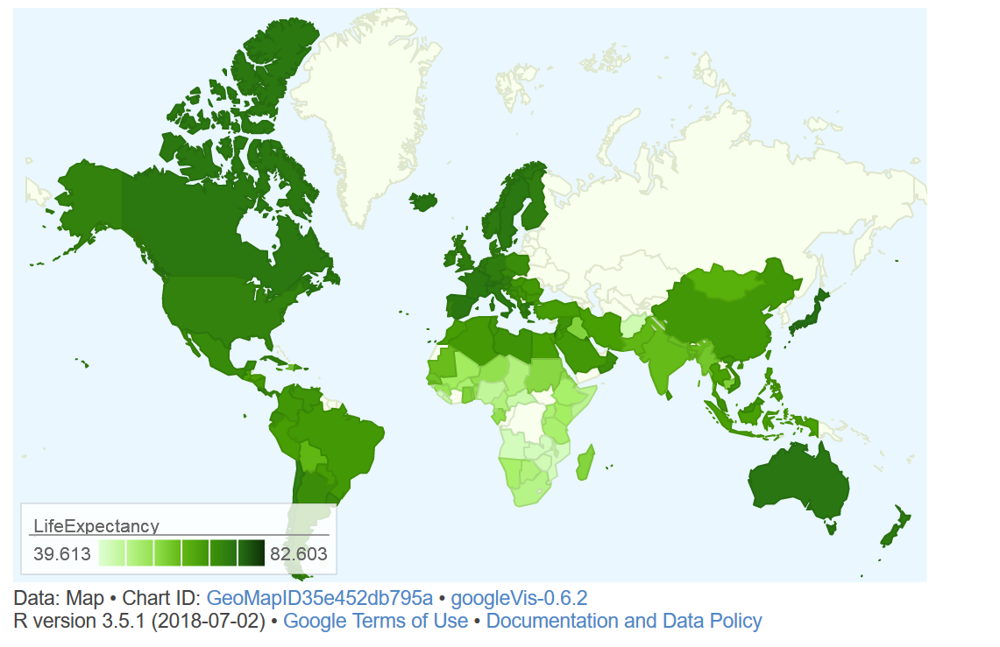

```{r uq1, echo=F, fig.cap="", message=FALSE, warning=FALSE, out.width='100%'}
knitr::include_graphics("images/uq1.jpg")
```

# Introduction{-}

This tutorial introduces geo-spatial data visualization in R. The entire R markdown document for this tutorial can be downloaded [here](https://slcladal.github.io/maps.Rdm).

This tutorial is based on R. If you have not installed R or are new to it, you will find an introduction to and more information how to use R [here](https://slcladal.github.io/IntroR_workshop.html). For this tutorials, we need to install certain *packages* from an R *library* so that the scripts shown below are executed without errors. Before turning to the code below, please install the packages by running the code below this paragraph. If you have already installed the packages mentioned below, then you can skip ahead ignore this section. To install the necessary packages, simply run the following code - it may take some time (between 1 and 5 minutes to install all of the libraries so you do not need to worry if it takes some time).

```{r prep1, echo=T, eval = F, message=FALSE, warning=FALSE}
# clean current workspace
rm(list=ls(all=T))
# set options
options(stringsAsFactors = F)         # no automatic data transformation
options("scipen" = 100, "digits" = 4) # suppress math annotation
op <- options(gvis.plot.tag='chart')  # set gViz options
# install libraries
install.packages(c("RgoogleMaps", "ggmap", "mapproj", "sf",
                   "dplyr", "OpenStreetMap", "devtools", "DT"))
# install package from github
devtools::install_github("dkahle/ggmap", ref = "tidyup")
```

```{r prep2, echo=F, eval = T, message=FALSE, warning=FALSE}
op <- options(gvis.plot.tag='chart')  # set gViz options
```

Depending on the maps that are used in the visualization, it may also be necessary to access other data bases. One very useful data base for maps is, of course, Google Maps. However, to access Google Maps materials, installation and setting up other pieces of software is necessary. How to get access to Google's data is discussed below. In the following section, methods that do not require installation of software other than R.   

# Getting started with maps

The most basic way to display geospatial data is to simply download and display a map. In order to do that, we load the libraries necessary for extracting and plotting the map.

The package `OpenStreetMap` offers a range of maps with different features. To access the `OpenStreetMap` data base, it is necessary to install the package. Once the package is installed, we can simply extract the map and define the region we want to plot by defining the longitude and latitude of the upper left and lower right corner of the region we want to display. The argument `minNumTiles` defines the accuracy of the map, the higher the number of tiles, the higher the resolution. The type of map is defined by the `type` argument. The type argument defines from which server the map is extracted. Once we have extracted a map, we can plot it using the "plot" function. 

```{r map1, message=FALSE, warning=FALSE}
# load library
library(OpenStreetMap)
# extract map
AustraliaMap <- openmap(c(-8,110),
	c(-45,160),
#	type = "osm",
#	type = "esri",
	type = "nps",
	minNumTiles=7)
# plot map
plot(AustraliaMap)
```

In order to obtain different map types, we change the `type` argument. The following options are available for type: 

```{r map_options}
# load package 
library(DT)
opt <- c("osm", "osm-bw","maptoolkit-topo", "waze", "bing", "stamen-toner", "stamen-terrain", "stamen-watercolor", "osm-german", "osm-wanderreitkarte", "mapbox", "esri", "esri-topo", "nps", "apple-iphoto", "skobbler", "hillshade", "opencyclemap", "osm-transport", "osm-public-transport", "osm-bbike", "osm-bbike-german")
opt <- data.frame(opt)
datatable(opt, rownames = FALSE, options = list(pageLength = 5, scrollX=T), filter = "none")
```

Unfortunately, not all options work. If they do not work, then an error message is shown telling us that the number of tiles is not supported.

We can zoom in or out by either changing the "zoom" or the "minNumTiles" arguments - in both cases, the higher the number, the more fine-grained the dispalyed map. Let's check out some examples for maps of Queensland.

```{r map2, message=FALSE, warning=FALSE}
# extract map
queensland1 <- openmap(c(-8,135),
	c(-30,160),
	type = "osm",
	minNumTiles=6)
queensland2 <- openmap(c(-8,135),
	c(-30,160),
	type = "esri",
	minNumTiles=6)
# plot maps
par(mfrow = c(1, 2)) # display plots in 1 row/2 columns
plot(queensland1); plot(queensland2); par(mfrow = c(1, 1)) # restore original settings
```

The `leaflet` function from the `leaflet` package creates a Leaflet map widget using html-widgets. The widget can be rendered on HTML pages generated from R Markdown, Shiny, or other applications. The advantage in using this function lies in the fact that it offers very detailed maps which enable zooming in to very specific locations.

```{r map3, message=FALSE, warning=FALSE}
# load package
library(leaflet)
# load library
m <- leaflet() %>% setView(lng = 153.05, lat = -27.45, zoom = 12)
# display map
m %>% addTiles()
```

## Generating maps with rworldmap and base R{-}

Another data base that is very useful when certain maps is the `rworldmap` package. The `rworldmap` package contains the shape files for countries but also more fine grained-shape files that display the states of selected countries. The most basic data, however, simply represents the shapes of the countries in the world.

Using the `worldmap` package has the advantage that one is not dependent on third parties and their servers but can operate within R without being denied access due to e.g. copy right issues or server maintenance.

```{r map5, message=FALSE, warning=FALSE}
# load library
library(rworldmap)
# get map
worldmap <- getMap(resolution = "coarse")
# plot world map
plot(worldmap, col = "lightgrey", 
     fill = T, border = "darkgray",
     xlim = c(-180, 180), ylim = c(-90, 90),
     bg = "aliceblue",
     asp = 1, wrap=c(-180,180))
```

The basic map shown above can then be modified and enriched with color coding to convey geospatial data. The following shows how to customize the world map.

```{r map6, message=FALSE, warning=FALSE}
# load library
library(maps)
# plot maps
par(mfrow = c(1, 2)) # display plots in 1 row/3 columns
# show map with Latitude 200 as center
map('world', xlim = c(100, 300))
# add axes
map.axes()
# show filled map with Latitude 200 as center
ww2 <- map('world', wrap=c(0,360), plot=FALSE, fill=TRUE)
map(ww2, xlim = c(100, 300), fill=TRUE)
par(mfrow = c(1, 1)) # restore original settings
```

## Generating maps with rnaturalearth and ggplot2{-}

We can also use the data provided by the `rnaturalearth` and the `rnaturalearthdata` and use `ggplot` function from the `ggplot2` package as well as the `sf` package to create very nice visualizations of geospatial data. The advantage over using `rworldmap` and base R lies in the fact that the code is easier to interpret and the visualizations are more appealing.

```{r map_gg1, message=FALSE, warning=FALSE}
# load packages
library(ggplot2)
library(sf)
library(rnaturalearth)
library(rnaturalearthdata)
# load data
world <- ne_countries(scale = "medium", returnclass = "sf")
# gene world map
ggplot(data = world) +
  geom_sf() +
  labs( x = "Longitude", y = "Latitude") +
  ggtitle("World map", subtitle = paste0("(", length(unique(world$admin)), " countries)"))
```

We can also easily zoom in on certain areas in the map using the `coord_sf` function and also prettify the map by adding some custom features such as a compass. 

```{r map_gg2, message=FALSE, warning=FALSE}
library(rgeos)
library(ggspatial)
# gene world map
ggplot(data = world) +
  geom_sf() +
  labs( x = "Longitude", y = "Latitude") +
  coord_sf(xlim = c(100.00, 160.00), ylim = c(-45.00, -10.00), expand = FALSE) +
  annotation_scale(location = "bl", width_hint = 0.5) +
  annotation_north_arrow(location = "bl", which_north = "true", 
                         pad_x = unit(0.75, "in"), pad_y = unit(0.5, "in"),
                         style = north_arrow_fancy_orienteering) +
  theme_bw()
```

We will now customize these basic maps and add information to them.

# Customizing Maps

Displaying basic maps is usually less interesting because, typically, we want to add different layers to a map. In order to add layers to a map, we need to have a shape file, i.e. a file which contains information about borders or locations that can then be displayed in different colors. In other words, we need to have a shape object to add information to the map.

```{r map_gg3, message=FALSE, warning=FALSE}
# extract locations
world_points<- st_centroid(world)
# extract labels
world_points <- cbind(world, st_coordinates(st_centroid(world$geometry)))
# generate annotated world map
ggplot(data = world) +
  geom_sf(fill= "gray90") +
  labs( x = "Longitude", y = "Latitude") +
  coord_sf(xlim = c(100.00, 180.00), ylim = c(-45.00, -10.00), expand = FALSE) +
  annotation_scale(location = "bl", width_hint = 0.5) +
  annotation_north_arrow(location = "bl", which_north = "true", 
                         pad_x = unit(0.75, "in"), pad_y = unit(0.5, "in"),
                         style = north_arrow_fancy_orienteering) +
  coord_sf(xlim = c(100.00, 180.00), ylim = c(-45.00, -10.00)) +
   theme(panel.grid.major = element_line(color = "gray60", linetype = "dashed", size = 0.25), 
         panel.background = element_rect(fill = "aliceblue")) +
  geom_text(data= world_points,aes(x=X, y=Y, label=name),
            color = "gray20", fontface = "italic", check_overlap = T, size = 3)
```

However, it is often the case that we want to add information that is not already available. Therefore, we load the `airports` data set which contains the longitude and latitude of airports across the world. We will then use this data to show the locations of airports across the globe. 

```{r cus1, message=FALSE, warning=FALSE}
# load data
airports <- read.delim("https://slcladal.github.io/data/airports.txt", 
                       sep = "\t", header = T)
# inspect data
datatable(airports, rownames = FALSE, options = list(pageLength = 5, scrollX=T), filter = "none")
```

To display the locations of airports on a map, we first plot the map and then add a layer of points to indicate the location of airports. In addition, the "plot" functions offers various arguments for customizing the display, e.g. by changing the backgroundcolor (bg), defining the color of borders (borders), defining the color of the shapes (fill and col). 

```{r cus2, message=FALSE, warning=FALSE}
# plot data on world map
plot(worldmap, xlim = c(-80, 160), ylim = c(-50, 100), 
     asp = 1, bg = "lightblue", col = "black", fill = T)
# add points
points(airports$Longitude, airports$Latitude, 
       col = "red", cex = .01)
```

It is, of course, also possible to highlight individual countries. 

```{r cus3, message=FALSE, warning=FALSE}
# create data frame with iso3 country codes and number of visits
countriesvisited <- data.frame(country = c("AUS", "JPN", "FIN", 
                                           "CZE", "POL", "AUT", 
                                           "USA", "GBR", "IRL", 
                                           "DEU", "DNK", "FRA", 
                                           "NDL", "BEL", "ESP",
                                           "HRV", "SVN", "NOR", 
                                           "ITA", "HUN", "ROU", 
                                           "BGR", "GRC", "TUR", 
                                           "CHE", "ARE"),
  visited = c(5, 1, 2, 1, 1, 3, 4, 4, 5, 11, 1, 1, 2, 2, 4, 4, 
              1, 1, 3, 1, 1, 2, 1, 1, 3, 2))
# inspect data
datatable(countriesvisited, rownames = FALSE, options = list(pageLength = 5, scrollX=T), filter = "none")
```

```{r cus4, message=FALSE, warning=FALSE}
# combine data frame with map
visitedMap <- joinCountryData2Map(countriesvisited, 
                                  joinCode = "ISO3",
                                  nameJoinColumn = "country")
# def. map parameters, e.g. def. colors
mapParams <- mapCountryData(visitedMap, 
                            nameColumnToPlot="visited",
                            oceanCol = "azure2",
                            catMethod = "categorical",
                            missingCountryCol = gray(.8),
                            colourPalette = c("coral",
                                              "coral2",
                                              "coral3", "orangered", 
                                              "orangered3", "orangered4"),
                            addLegend = F,
                            mapTitle = "",
                            border = NA)
# add legend and display map
do.call(addMapLegendBoxes, c(mapParams,
                             x = 'bottom',
                             title = "No. of visits",
                             horiz = TRUE,
                             bg = "transparent",
                             bty = "n"))
```


It is, of course also possible to show only a part of the map by defining the x- and y-axes limits of the plot window. 

```{r cus5, message=FALSE, warning=FALSE}
# get map
newmap <- getMap(resolution = "low")
# plot map
plot(newmap, xlim = c(-20, 59), ylim = c(35, 71), 
     asp = 1, fill = T, border = "darkgray", 
     col = "wheat2", bg = "gray95")
# add points
points(airports$Longitude, airports$Latitude, col = "red", cex = .5, pch = 20)
```

This is of course also possible to show Australian airports.

```{r cus6, message=FALSE, warning=FALSE}
# plot data on world map
plot(worldmap, xlim = c(110, 160), ylim = c(-45, -10), 
     asp = 1, bg = "azure2", border = "lightgrey", col = "wheat1", 
     fill = T, wrap=c(-180,180))
points(airports$Longitude, airports$Latitude, 
       col = "darkblue", cex = .5, pch = 20)
```

In addition to the location of airports, it is also possible to show how many flights arrive at an airport. As this information is not provided in the airport data, we load the routes data which contains information about the routes that airlines fly. 

```{r cus7, message=FALSE, warning=FALSE}
# read in routes data
routes <- read.delim("https://slcladal.github.io/data/routes.txt", 
                     sep = "\t", header=T)
# inspect data
datatable(routes, rownames = FALSE, options = list(pageLength = 5, scrollX=T), filter = "none")
```

To show the number of arrivals at an airport (only in terms of how mayn routes end at that airport), we extract the number of routes that end in each airport.

```{r cus8, message=FALSE, warning=FALSE}
# load library
library(plyr)
# extract number of arrivals
arrivals <- ddply(routes, .(destinationAirportID), "nrow")
names(arrivals)[2] <- "flights"
# inspect data
datatable(arrivals, rownames = FALSE, options = list(pageLength = 5, scrollX=T), filter = "none")
```

We can now merge the airports and the arrival data set to combine the information about the location with the information about the number of routes that end at each airport.

```{r cus9, message=FALSE, warning=FALSE}
# create arrival  table
airportA <- merge(airports, arrivals, by.x = "ID", by.y = "destinationAirportID")
# inspect data
datatable(airportA, rownames = FALSE, options = list(pageLength = 5, scrollX=T), filter = "none")
```

This table allows us to plot not only the location of airports but also the number of routes that end there.

```{r cus10, message=FALSE, warning=FALSE}
# get map
australia <- getMap(resolution = "low")
# plot data on world map
plot(australia, xlim = c(110, 160), ylim = c(-45, -10), 
     asp = 1, bg = "azure1", border = "darkgrey", 
     col = "wheat2", fill = T)
# add points
points(airportA$Longitude, airportA$Latitude,
       # define colors as transparent
       col = rgb(red = 0, green = 0, blue = 1, alpha = 0.3),
       # define size as number of flights div. by 50
       cex = airportA$flights/50, pch = 20)
```

The same map can also be created using the `ggplot2` package which offers a very high degree of flexibility and allows for easy customization. 

```{r cus11, message=FALSE, warning=FALSE}
# create a layer of borders
ggplot(airportA, aes(x=Longitude, y= Latitude)) +   
  borders("world", colour=NA, fill="wheat1")  +
  geom_point(color="blue", alpha = .2, size = airportA$flights/20) +
  scale_x_continuous(name="Longitude", limits=c(110, 160)) +
  scale_y_continuous(name="Latitude", limits=c(-45, -10)) +
  theme(panel.background = element_rect(fill = "azure1", colour = "azure1")) +
  geom_text(aes(x=Longitude, y= Latitude, label=City),
            color = "gray20", check_overlap = T, size = 3)
```

In addition, it may be useful to overlay an area with shading to indicate the density of airports orflights.

```{r cus12, message=FALSE, warning=FALSE}
# create map with density layer
ggplot(airportA, (aes(x = Longitude, y= Latitude))) +   
  borders("world", colour=NA, fill="antiquewhite")  +
  stat_density2d(aes(fill = ..level..,  alpha = I(.2)),
                 size = 1, bins = 5, data = airportA,
                 geom = "polygon") +
  geom_point(color="red", alpha = .2, size=airportA$flights/100) +
  # define color of density polygons
  scale_fill_gradient(low = "grey50", high = "grey20") +
  theme(panel.background = element_rect(fill = "lightblue",
                                colour = "lightblue"),
        panel.grid.major = element_blank(), 
        panel.grid.minor = element_blank(),
        # surpress legend
        legend.position = "none",
        axis.line=element_blank(),
        axis.text.x=element_blank(),
        axis.text.y=element_blank(),
        axis.ticks=element_blank(),
        axis.title.x=element_blank(),
        axis.title.y=element_blank()) +
  geom_text(aes(x=Longitude, y= Latitude, label=Name),
            color = "gray20", fontface = "italic", check_overlap = T, size = 2,
            alpha = sqrt(airportA$flights)/10)
```


```{r cus13, message=FALSE, warning=FALSE}
# load library
library(ggmap)
# define box
sbbox <- make_bbox(lon = c(115, 155), lat = c(-12.5, -42), f = .1)
# get map
ausbg = get_map(location=sbbox, zoom=4,
#                source = "google",
                source = "osm",
#                source = "stamen",
                color = "bw",
#                color = "color",
#               maptype="terrain")
#               maptype="terrain-background")
                maptype="satellite")
#               maptype="hybrid")
#               maptype="toner")
#               maptype="hybrid")
#               maptype="terrain-labels")
#               maptype="roadmap")
# create map
ausbg = ggmap(ausbg)
# display map
ausbg +
  stat_density2d(data = airportA, aes(x = Longitude, y= Latitude, 
                     fill = ..level..,  alpha = I(.2)),
                 size = 1, bins = 5, geom = "polygon") +
  geom_point(data = airportA, mapping = aes(x=Longitude, y= Latitude), 
             color="gray20", alpha = .2, size=airportA$flights/20) +
  # define color of density polygons
  scale_fill_gradient(low = "grey50", high = "grey20") +
  theme(axis.line=element_blank(),
        axis.text.x=element_blank(),
        axis.text.y=element_blank(),
        axis.ticks=element_blank(),
        axis.title.x=element_blank(),
        axis.title.y=element_blank(),
        panel.background = element_rect(fill = "aliceblue",
                                colour = "aliceblue"),
        panel.grid.major = element_blank(), 
        panel.grid.minor = element_blank(),
        # surpress legend
        legend.position = "none")
```

```{r cus14, message=FALSE, warning=FALSE}
# define box
sbbox <- make_bbox(lon = c(152.8, 153.4), lat = c(-27.1, -27.7), f = .1)
# get map
brisbane = get_map(location=sbbox, zoom=10,
               maptype="terrain")
# create map
brisbanemap = ggmap(brisbane)
# display map
brisbanemap +
  geom_point(data = airportA, mapping = aes(x = Longitude, y = Latitude), 
               color = "red") +
  geom_text(data = airportA, 
            mapping = aes(x = Longitude+0.1,
                          y = Latitude,
                          label = "Brisbane Airport"),
            size = 2, color = "gray20", 
            fontface = "bold", 
            check_overlap = T) 
```

# Color Coding Geospatial Information

We can also use color coding of countries to convey information about different features of countries such as their population size (or results of political elections, etc.).

We use the data provided in the `rnaturalearthdata` and `rnaturalearth` packages, which contain information about the population size of countries, to color code and thus visualize differences in population size by country.

```{r col1, message=FALSE, warning=FALSE}
# extract world data
world <- ne_countries(scale = "medium", returnclass = "sf")
# create cut off points in Population
world$pop_estC <- base::cut(world$pop_est,
                        breaks = c(0, 500000, 1000000, 10000000, 
                                   100000000, 200000000, 500000000,
                                   10000000000), 
                        labels = 1:7, right = F, ordered_result = T)
# load library
library(RColorBrewer)
# define colors
palette = colorRampPalette(brewer.pal(n=7, name='Oranges'))(7)
palette = c("white", palette)
# create map
worldpopmap <- ggplot() +
  geom_sf(data = world, aes(fill = pop_estC)) +
  scale_fill_manual(values = palette) +
  # customize legend title
  labs(fill = "Population Size") +
  theme(panel.grid.major = element_blank(), 
        panel.grid.minor = element_blank(),
        # surpress legend
        legend.position = "none")
# display map
worldpopmap
```

We can also scale the colors and add a legend to assist with the interpretation of the map.

```{r col2, message=FALSE, warning=FALSE}
# start plot
ggplot(data = world) +
    geom_sf(aes(fill = pop_est)) +
  scale_fill_viridis_c(option = "plasma", trans = "sqrt") +
  # customize legend title
  labs(fill = "Population Size")
```

It is relatively easy to combine color coding with points. However, it is also relatively easy to color countries if all countries have values. If this is not the case (as in the example below), we need to include an additional step so that countries that are not mentioned also receive a color coding. In this example, the data contain countries and cities that I have visited along with their latitude and longitude.

```{r col4, echo=F, eval = F, message=FALSE, warning=FALSE}
# create vector with places I have visited
visited <- data.frame(matrix(c(
  "Australia", "AUS", "Brisbane", -27.455, 153.0351,
  "Australia", "AUS", "Adelaide",	-34.935,	138.6,
  "Australia", "AUS", "Canberra",	-35.283,	149.129,
  "Australia", "AUS", "Sydney",	-33.92,	151.1852,
  "Australia", "AUS", "Melbourne",	-37.82,	144.975,
  "Japan", "JPN", "Tokyo",	35.685,	139.7514,
  "Finland", "FIN", "Helsinki",	60.1756,	24.9341,
  "Finland", "FIN", "Tampere",	61.5,	23.75,
  "Czech Republic", "CZE", "Prague",	50.0833,	14.466,
  "Poland", "POL", "Poznan",	52.4058,	16.8999,
  "Austria", "AUT", "Vienna",	48.2,	16.3666,
  "Austria", "AUT", "Innsbruck",	47.2804,	11.41,
  "Austria", "AUT", "Salzburg",	47.79941, 13.04399,
  "United States", "USA", "New York",	40.6943,	-73.9249,
  "United States", "USA", "Kansas City",	39.1239,	-94.5541,
  "United States", "USA", "St. Louis",	38.627003, -90.199402,
  "United States", "USA", "Chicago",	41.881832, -87.623177,
  "United Kingdom", "GBR", "London",	51.500,	-0.1167,
  "United Kingdom", "GBR", "Cardiff",	51.481583, -3.179090,
  "Ireland", "IRL", "Galway",	53.2724,	-9.0488,
  "Ireland", "IRL", "Dublin",	53.3331,	-6.2489,
  "Ireland", "IRL", "Limerick",	52.668018, -8.630498,
  "Ireland", "IRL", "Athlone",	53.423933, -7.94069,
  "Ireland", "IRL", "Bray",	53.20278, -6.09833,
  "United Kingdom", "GBR", "Belfast",	54.607868, -5.926437,
  "United Kingdom", "GBR", "Derry",	54.9981, -7.30934,
  "Germany", "DEU", "Hamburg",	53.55,	10.00,
  "Germany", "DEU", "Kassel", 51.31667, 9.5,
  "Germany", "DEU", "Berlin",	52.5218,	13.4015,
  "Germany", "DEU", "Cologne",	50.93,	6.95,
  "Germany", "DEU", "Munich",	48.1299,	11.575,
  "Germany", "DEU", "Mainz",	49.98419, 8.2791,
  "Germany", "DEU", "Frankfurt",	50.11552, 8.68417,
  "Germany", "DEU", "Hannover",	52.37052, 9.73322,
  "Germany", "DEU", "Bremen",	53.07516, 8.80777,
  "Germany", "DEU", "Bonn",	50.73438, 7.09549,
  "Germany", "DEU", "Greifswald",	54.09311, 13.38786,
  "Denmark", "DNK", "Copenhagen", 55.67594, 12.56553,
  "France", "FRA", "Paris",	48.8667,	2.3333,
  "Netherlands", "NDL", "Amsterdam",	52.35,	4.9166,
  "Netherlands", "NDL", "Arnhem",	51.98, 5.91111,
  "Belgium", "BEL", "Antwerpen",	51.2204,	4.415,
  "Belgium", "BEL", "Leuven",	50.87959, 4.70093,
  "Spain", "ESP", "Madrid",	40.4,	-3.6834,
  "Spain", "ESP", "Gibraltar",	35.946339, -5.655601,
  "Spain", "ESP", "Mallorca",	39.56939, 2.65024,
  "Spain", "ESP", "Fuerteventura",	28.413460, -14.008890, 
  "Croatia", "HRV", "Zagreb",	45.8,	16,
  "Croatia", "HRV", "Novi Vinodolski", 45.12806, 14.78889,
  "Croatia", "HRV", "Djakovo", 45.309997, 18.409782,
  "Croatia", "HRV", "Rieka", 45.34306, 14.40917,
  "Slovenia", "SVN", "Maribor", 46.55472, 15.64667,
  "Norway", "NOR", "Bergen",	60.391,	5.3245,
  "Italy", "ITA", "Rome",	41.896,	12.4833,
  "Italy", "ITA", "Venice",	45.43713, 12.33265,
  "Italy", "ITA", "Trieste",	45.64325, 13.7903,
  "Hungary", "HUN", "Budapest",	47.5,	19.0833,
  "Romania", "ROU", "Bucarest",	44.439663, 26.096306,
  "Bulgaria", "BGR", "Sofia",	42.698334, 23.319941,
  "Bulgaria", "BGR", "Varna",	43.204666, 27.910543,
  "Greece", "GRC", "Athens",	37.9833,	23.7333,
  "Turkey", "TUR", "Istanbul",	41.105,	29.01,
  "Switzerland", "CHE", "Zurich",	47.38,	8.55,
  "Switzerland", "CHE", "Basel",	47.5804,	7.59,
  "United Arab Emirates", "ARE", "Dubai",	25.23,	55.28,
  "United Arab Emirates", "ARE", "Abu Dhabi",	24.4667,	54.3666,
  "United Kingdom", "GBR", "Edinburgh", 55.953251, -3.188267), 
  ncol = 5, byrow = T))
colnames(visited) <- c("Country", "ISO3", "City", "Latitude", "Longitude")
visited$Longitude  <- as.numeric(visited$Longitude)
visited$Latitude <- as.numeric(visited$Latitude)
# order table
visited <- visited[order(visited$Country, visited$City),]
# write to disc
write.table(visited, "D:\\Uni\\UQ\\LADAL\\SLCLADAL.github.io\\data/visited.txt", sep = "\t", col.names=T, row.names = F)
# inspect data
datatable(visited, rownames = FALSE, options = list(pageLength = 5, scrollX=T), filter = "none")
```


```{r col5, message=FALSE, warning=FALSE}
# load data
visited <- read.delim("https://slcladal.github.io/data/visited.txt", 
                      sep = "\t", header = T)
# inspect data
datatable(visited, rownames = FALSE, options = list(pageLength = 5, scrollX=T), filter = "none")
```

After loading the data, we determine how many cities I have visited in a given country and add this frequency to the data set.

```{r col6, message=FALSE, warning=FALSE}
# determine how often a country was visited
ncountry <- as.data.frame(table(visited$ISO3))
colnames(ncountry)[1] <- "ISO3" 
# add frequency to visited
visited <- merge(visited, ncountry, by = "ISO3")
# inspect data
datatable(visited, rownames = FALSE, options = list(pageLength = 5, scrollX=T), filter = "none")
```

The next part is tricky as we do not only need to determine the color for the countries I have visited but also the color for those that I have not visited. In order to do that, we load the data set that underlies the world map that will be displayed.

```{r col7, message=FALSE, warning=FALSE}
# load library
library(maptools)
# load world data for plotting 
data(wrld_simpl)
# def. color (bias for contrast)
pal <- colorRampPalette(brewer.pal(6, 'Greens'), 
                        bias = 10)(length(visited$Freq))
pal <- pal[with(visited, findInterval(Freq, sort(unique(Freq))))]
# define color for countries not in visited
countrycolor <- rep("white", length(wrld_simpl@data$NAME))
# define colors for countries in visited
countrycolor[match(visited$Country, wrld_simpl@data$NAME)] <- pal
```

After assigning colors to all countries, we can proceed by plotting the color coded map along with points for the locations of the cities I have visited.

```{r col8, message=FALSE, warning=FALSE}
# plot map
plot(wrld_simpl, ylim=c(-40, 85), xlim = c(-180, 180),
     mar=c(0,0,0,0), bg="gray40", border = NA, 
     col=countrycolor)
# add points
points(visited$Longitude, visited$Latitude, col="red", pch=20, cex = .5)
```

A slightly more elegent way to achive the same goal is to plot the information using the `ggplot2` package.

```{r col9, message=FALSE, warning=FALSE}
# use the contry name instead of 3-letter ISO as id
wrld_simpl@data$id <- wrld_simpl@data$NAME
wrld <- fortify(wrld_simpl, region="id")
# remove Antarctica from map
wrld <- subset(wrld, id != "Antarctica") 
# change column names of visited
colnames(visited) <- ifelse(colnames(visited) == "Country", 
                            "id", 
                            colnames(visited))
# combine visited and wrld
worlddata <- join(wrld, visited, by = "id")
# change NA to 0
worlddata$Freq <- ifelse(is.na(worlddata$Freq) == T, 0, worlddata$Freq)
# convert freq into factor
worlddata$Freq <- as.factor(worlddata$Freq)
# start plotting
ggmapplot <- ggplot() + 
  geom_map(data=worlddata, map=worlddata, 
           aes(map_id=id, x=long, y=lat, 
           fill=Freq), color=NA, size=0.25) + 
  geom_point(data = visited,
             aes(x = Longitude, y = Latitude), 
             col = "red", size = .75) +
  scale_fill_manual(values=c("white", "gray80", "gray75", 
                             "gray70",  "gray65", "gray60", "gray55"), 
                    name="No. cities visited") + 
#  coord_map("gilbert") +  # spherical
  coord_map() +           # for normal Mercator projection
  labs(x="", y="") + 
  theme(plot.background = element_rect(fill = "grey40", colour = NA),
                   panel.border = element_blank(),
                   panel.background = 
          element_rect(fill = "transparent", colour = NA),
                   panel.grid = element_blank(),
                   axis.text = element_blank(),
                   axis.ticks = element_blank(),
                   legend.position = "right")
ggmapplot
```


# Interactive Maps

An easy way to create interactice maps is to use the "googleVis" package. An example showing the population size by country provided by an in-built data set is shown.

```{r imap1a, message=FALSE, warning=FALSE}
# load library
library(googleVis)
# create motion chart object
Geo=gvisGeoMap(Population, locationvar="Country", numvar="Population", 
               options = list(height=350, daatMode='regions'))
```

```{r results='asis'}
print(Geo, 'chart')
```

A browser window should open and and if you accept and execute Adobe Flash, then an interactive map like the one above showing the population size by country. You should also be able to hoover over any country and see its population size. 

```{r imap2, eval = F,  echo=F, fig.cap="", message=FALSE, warning=FALSE, out.width='100%'}
knitr::include_graphics("images/motionchart_worldpopulation.png")
```

You can also use the `googleVis` package to create customized maps. To customize an interactive map, we need to load a data set.

```{r imap3, message=FALSE, warning=FALSE}
# load data 
gapminderdata <- read.delim("https://slcladal.github.io/data/gapminder.txt",
                            header = T, sep = "\t")
# create map
Map <- data.frame(gapminderdata$country, 
                  gapminderdata$year, gapminderdata$lifeExp)
# def. column names
names(Map) <- c("Country", "Year", "LifeExpectancy")
# inspect data
datatable(Map, rownames = FALSE, options = list(pageLength = 5, scrollX=T), filter = "none")
```

We will only use the latest data (from 2007) and exclude all other data points and create the interactive map as we did above.

```{r imap4a, message=FALSE, warning=FALSE}
# remove data point not from 2007
Map <- Map[Map$Year == "2007",]
# create motion chart object
Geo=gvisGeoMap(Map, locationvar = "Country", numvar = "LifeExpectancy", 
               options = list(height = 350, dataMode = 'regions'))
```

```{r results='asis'}
print(Geo, 'chart')
```


```{r imap5, echo=F, eval = F, fig.cap="", message=FALSE, warning=FALSE, out.width='100%'}

```

Again, a browser window should open and and if you accept and execute Adobe Flash, then an interactive map like the one above showing the life expectancy by country. You should also be able to hoover over any country and see its available life expectancy. 

# Creating Maps with tmap and Shape Files

When creating more sophisticated maps, it is common to use shape files. Shape files define the edges of polygons and can be very complex depending on the number of edges of a polygon. 

```{r shp1, message=FALSE, warning=FALSE}
# load libraries
library(sf)
library(tmap) 
# load shape file
ausstates <- sf::st_read("D:\\Uni\\UQ\\SLC\\LADAL\\SLCLADAL.github.io\\data\\shapes/AshmoreAndCartierIslands.shp", stringsAsFactors = F)
# plot australian admin shape file
tm_shape(ausstates) +
  tm_fill() +
  tm_borders()
```

```{r shp3, message=FALSE, warning=FALSE}
# load library
library(rgdal)
# load shape files
ausstates <- readOGR(dsn = "D:\\Uni\\UQ\\SLC\\LADAL\\SLCLADAL.github.io\\data\\shapes/AshmoreAndCartierIslands.shp", stringsAsFactors = F)
ausstatesadmin <- readOGR(dsn = "D:\\Uni\\UQ\\SLC\\LADAL\\SLCLADAL.github.io\\data\\shapes/Australia_admin_6.shp", stringsAsFactors = F)
# plot australia and queensland
ozmap <- ggplot() + 
  geom_polygon(data = ausstates, 
               aes(x = long, y = lat, group = group),
               colour = "black", fill = NA) +
  geom_polygon(data = ausstatesadmin, 
                 aes(x = long, y = lat, group = group), 
                 colour = "red", fill = NA) +
  theme_void()
# plot map
ozmap
```


```{r shp4, message=FALSE, warning=FALSE}
# inspect shape file
summary(ausstates@data)

table(ausstates@data$name)

ausstates_df <- broom::tidy(ausstates, region = "name")
```

```{r shp5, message=FALSE, warning=FALSE}
# extract names of states
cnames <- aggregate(cbind(long, lat) ~ id, data=ausstates_df, FUN=mean)
# define colors
# Define the number of colors you want
library(RColorBrewer)
nb.cols <- 15
newcolors <- colorRampPalette(brewer.pal(8, "Oranges"))(nb.cols)
# plot australian admin shape file
ausadminmap <- ggplot() +
  # plot australian state shapes
  geom_polygon(data = ausstates_df, 
               aes(x = long, y = lat, group = group, fill = id), 
               asp = 1, colour = NA) +
  geom_text(data = cnames, aes(x = long, y = lat, label = id), 
            size = 2, color = "gray20", fontface = "bold", 
            check_overlap = T) +
  # def. manual colors
  scale_fill_manual(values = newcolors) +
  # use empty theme
  theme_void() +
  scale_x_continuous(name="Longitude", limits=c(112, 155)) +
  scale_y_continuous(name="Latitude", limits=c(-45, -10)) +
  # def. background color
  theme(panel.background = element_rect(fill = "slategray1",
                                colour = "slategray1",
                                size = 0.5, linetype = "solid"),
        legend.position = "none")
# plot map
ausadminmap
```

```{r shp6, message=FALSE, warning=FALSE}
# create data frame with longitude and latitude values
Latitude <- c(-25, -27.5, -25, -30, -30, -35, -25)
Longitude <- c(150, 140, 130, 135, 140, 147.5, 150)
mypolygon <- as.data.frame(cbind(Longitude,Latitude))
# inspect data
mypolygon
```

```{r shp7, message=FALSE, warning=FALSE}
# plot australian admin shape file
ausadminmap <- ggplot() +
# plot state shapes
  geom_polygon(data = ausstates_df, 
               aes(x = long, y = lat, group = group), 
               asp = 1,
               fill = "wheat1", 
               colour = "gray90") +
  ggplot2::geom_text(data = cnames, aes(x = long, y = lat, label = id), 
            size = 2, color = "gray20", 
            fontface = "bold", 
            check_overlap = T) +
  # add customized polygon
  geom_polygon(data=mypolygon,aes(x=Longitude,y=Latitude),
               alpha=0.5,colour="gray20",fill="red") +
  annotate("text", x = mean(Longitude),y = mean(Latitude),
           label = "My Polygon Area", colour="white", size=3) +
  # def. manual colors
  scale_fill_manual(values = newcolors) +
  # add north arrow
  ggsn::north(ausstates_df, scale = .1) +
  # use empty theme
  theme_void() +
  scale_x_continuous(name="Longitude", limits=c(112, 155)) +
  scale_y_continuous(name="Latitude", limits=c(-45, -10)) +
  # def. background color
  theme(panel.background = element_rect(fill = "slategray1",
                                colour = "slategray1",
                                size = 0.5, linetype = "solid"))
# plot map
ausadminmap
```

```{r hidetext1, echo=F, eval = F, message=FALSE, warning=FALSE}

# Using and customizing Google maps in R

Unfortunately, Google made accessing their database more restrictive which means that we need to register an API accessing the database. Before we can start creating maps we therefore need to obtain an (API key from Google)[https://developers.google.com/maps/documentation/geocoding/get-api-key]. Go to the (registration page)[https://cloud.google.com/maps-platform/#get-started], and follow the instructions (select all mapping options). The geocoding API is a free service, but you nevertheless need to associate a credit card with the account.

# Installing the ggmap package

The existing CRAN version of ggmap is 2.6.1. This version does unfortunately not yet enable using the Google API. The current version on GitHub is further advanced and fixes the issue. To install the GitHub version, you need to use the devtools package.
```

```{r map19, echo=F, eval = F, message=FALSE, warning=FALSE}
# load libraries
library(sf)
library(RgoogleMaps)
# retrieve map
map <- get_map(location = 'Australia', zoom = 4)
ggmap(map)
```

```{r map20, echo=F, eval = F, message=FALSE, warning=FALSE}
library(ggmap)
library(mapproj)
map <- get_map(location = 'Europe', zoom = 4)
ggmap(map)
```


```{r map17, echo=F, eval = F, message=FALSE, warning=FALSE}
#map <- get_map(location = "Europe")
# plot map and layers
mapPoints <- ggmap() + map
  geom_point(aes(x = lon, y = lat, 
                 size = sqrt(flights)), 
             data = airportD, alpha = .5)
mapPointsLegend <- mapPoints +
  scale_area(breaks = sqrt(c(1, 5, 10, 50, 100, 500)), 
             labels = c(1, 5, 10, 50, 100, 500), 
             name = "departing routes")
mapPointsLegend


# create the data set containing both departures and arrivals
airportD$type <- "departures"
airportA$type <- "arrivals"
airportDA <- rbind(airportD, airportA)

# map the data
# map + data points
mapPointsDA <- ggmap(map) +
  geom_point(aes(x = lon, y = lat, size = sqrt(flights)), 
             data = airportDA, alpha = .5)
# adjust the legend
mapPointsLegendDA <- mapPointsDA +
  scale_area(breaks = sqrt(c(1, 5, 10, 50, 100, 500)), 
             labels = c(1, 5, 10, 50, 100, 500), name = "routes")
# panels according to type (departure/arrival)
mapPointsFacetsDA <- mapPointsLegendDA +
  facet_grid(. ~ type)
# plot the map
mapPointsFacetsDA
```

```{r resetOptions}
## Set options back to original options
options(op)
```

# Citation & Session Info {-}

Schweinberger, Martin. 2020. *Displaying Geo-Spatial Data with R*. Brisbane: The University of Queensland. url: https://slcladal.github.io/maps.html (Version 2020.09.29).

```
@manual{schweinberger2020maps,
  author = {Schweinberger, Martin},
  title = {Displaying Geo-Spatial Data with R},
  note = {https://slcladal.github.io/maps.html},
  year = {2020},
  organization = "The University of Queensland, Australia. School of Languages and Cultures},
  address = {Brisbane},
  edition = {2020/09/29}
}
```

```{r fin}
sessionInfo()
```

***

[Main page](https://slcladal.github.io/index.html)

***

# References {-}

