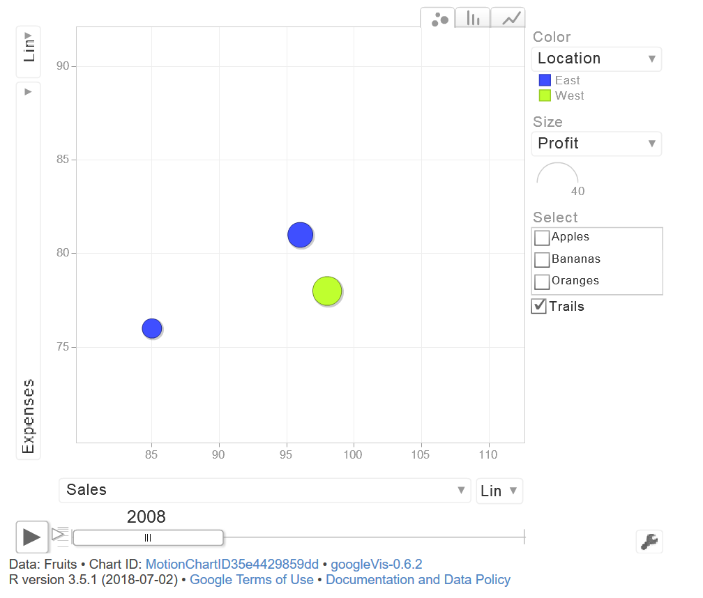
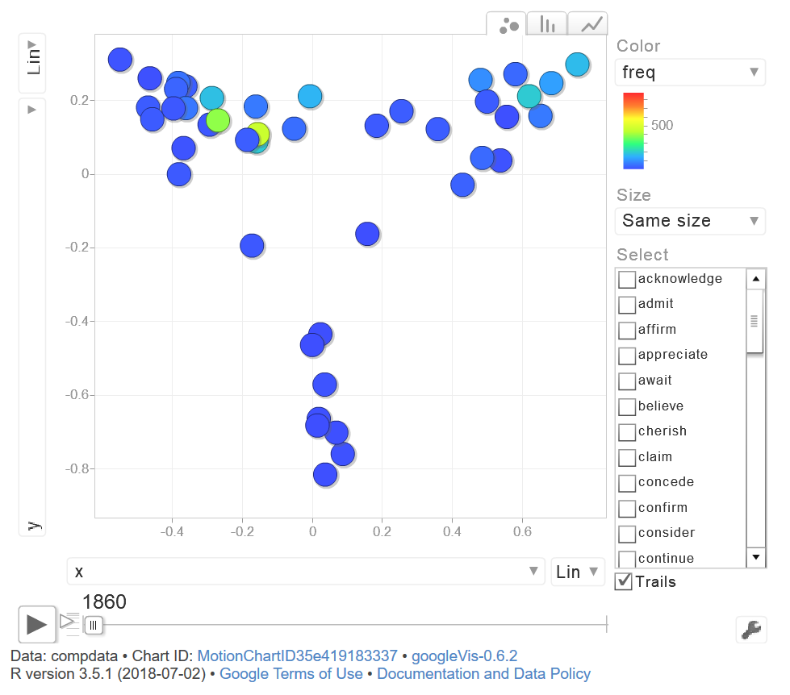

```{r uq1, echo=F, fig.cap="", message=FALSE, warning=FALSE, out.width='100%'}
knitr::include_graphics("images/uq1.jpg")
```

# Introduction

This tutorial introduces motion charts in "R". The entire code for the sections below can be downloaded [here](https://slcladal.github.io/rscripts/motionrscript.r).

# Preparation and session set up

As all visualizations in this tutorial rely on "R", it is necessary to install "RStudio" (a programm which makes working with R particularly user-friendly). If "RStudio" is not already installed on your machine, please search for "RStudio" in your favorite search engine and add the term "download". Open any of the first few links and follow the installation instructions (they are easy to follow, do not require any specifications, and are pretty much self-explanatory). Once you have installed "RStudio", open it.

In addition, we prepare our session by clearing the workspace, setting options, and installing certain "libraries" or "packages" that we need in this tutorial. Thus, please install the libraries by running the code below this paragraph (simply copy and paste the code into the editor window of RStudio and select "Run" from the task bar above) - the installation may take some time (depending on the number and the nature of the libraries it may take a couple of minutes).

```{r prep1, echo=T, eval = F, message=FALSE, warning=FALSE}
# clean current workspace
rm(list=ls(all=T))
# set options
options(stringsAsFactors = F)         # no automatic data transformation
options("scipen" = 100, "digits" = 4) # supress math annotation
# install libraries
install.packages(c("googleVis", "dplyr"))
```

Now that "RStudio" is running and the session is set up, we can begin with the tutorial.

# Getting started with Motion Charts

To get started with motion charts, we load the "googleVis" package and use an in-built data set called "Fruits".

```{r mot1, echo=T, eval = T, message=FALSE, warning=FALSE}
# load library
library(googleVis)
# inspect fruid data set
str(Fruits)
```

```{r mot2, echo=T, eval = T, message=FALSE, warning=FALSE}
# create motion chart object
M <- gvisMotionChart(Fruits, idvar = "Fruit", timevar = "Year")
# display motion chart object
plot(M)
```

A browser window should open and and if you accept Adobe Player, then motion chart showing the population size by country should pop up. You can hoover over any country and see its population size. 

```{r mot3, echo=F, fig.cap="", message=FALSE, warning=FALSE, out.width='100%'}

```

The motion chart then shows changes in Sales (x-axis) and Expenses (y-axis) across time.

# Motion Charts and Language Data

We now turn to a linguistic example. The phenomenon we will use 
Linguistic Example: which verbs take which complement clause type?

```{r mot4, echo=T, eval = T, message=FALSE, warning=FALSE}
# read in data
compdata <- read.table("D:\\R\\MapsInR/compdata.txt", sep = "\t", header = T)
# inspect data structure
str(compdata)
```


```{r mot5, echo=T, eval = T, message=FALSE, warning=FALSE}
# create motion chart object
MC <- gvisMotionChart(compdata, idvar = "verb", timevar = "decade")
# display motion chart object
plot(MC)
```

```{r mot6, echo=F, fig.cap="", message=FALSE, warning=FALSE, out.width='100%'}

```

# Linguistic Example: which verbs take which complement clause type?

```{r mot9, echo=T, eval = T, message=FALSE, warning=FALSE}
# load data
convdata <- read.table("D:\\R\\MapsInR/convdata.txt", sep = "\t", header = T)
# inspect data structure
str(convdata)
```


```{r mot10, echo=T, eval = T, message=FALSE, warning=FALSE}
# create motion chart object
MC <- gvisMotionChart(convdata, idvar = "VERB", timevar = "DECADE")
# display motion chart object
plot(MC)
```


```{r mot11, echo=T, eval = T, message=FALSE, warning=FALSE}
# load data
ampadjdata <- read.table("D:\\Uni\\Projekte\\02-Intensification\\AmpCOHA/collex_decade.txt", sep = "\t", header = T)
# load library
library(dplyr)
# process data
ampadjdata <- ampadjdata %>%
  select(Decade, Amp, Adjective, OBS) %>%
  rename(Frequency = OBS) %>%
  mutate(Bigram = paste(Amp, Adjective, sep = "")) %>%
  select(Decade, Bigram, Frequency)
# inspect data
head(ampadjdata)
```

```{r mot12, echo=T, eval = T, message=FALSE, warning=FALSE}

# create motion chart
MC <- gvisMotionChart(ampadjdata, idvar = "Bigram", timevar = "Decade")
plot(MC)
```


```{r mot13, echo=T, eval = T, message=FALSE, warning=FALSE}
intsaus <- read.table("D:\\Uni\\Projekte\\02-Intensification\\AmpAusENZE/datadf5.txt", 
                      sep = "\t", header = T)
intsaus <- intsaus[intsaus$int == 1,]
intsaus <- intsaus[intsaus$txtyp == "PrivateDialogue",]
# label infrequent amplifier as "other"
freqpinttb <- table(intsaus$pint)
freqpint <- names(freqpinttb)[which(freqpinttb >= 10)]
intsaus$pint <- as.vector(unlist(sapply(intsaus$pint, function(x){
  x <- ifelse(x %in% freqpint, x, "other")
})))
# label infrequent adjective as "other"
freqadjtb <- table(intsaus$adj)
freqadj <- names(freqadjtb)[which(freqadjtb >= 20)]
intsaus$adj <- as.vector(unlist(sapply(intsaus$adj, function(x){
  x <- ifelse(x %in% freqadj, x, "other")
})))


table(intsaus$pint)
str(intsaus)
```

```{r mot14, echo=T, eval = T, message=FALSE, warning=FALSE}

t1 <- ftable(intsaus$pint, intsaus$adj, intsaus$age)
t1
```

```{r mot15, echo=F, eval = F, message=FALSE, warning=FALSE}
amplifiers <- as.vector(unlist(attr(t1, "row.vars")[1]))
adjectives <- as.vector(unlist(attr(t1, "row.vars")[2]))
age <- as.vector(unlist(attr(t1, "col.vars")[1]))

age

amp <- c(rep(c(rep(amplifiers, each = 5)), 5))
adj <- c(rep(c(rep(adjectives, 5)), 5))
age <- rep(age, 25)         
freqs <- as.vector(unlist(t1))

ampaus <- data.frame(age, amp, adj, freqs)
colnames(ampaus) <- c("age", "amp", "adj", "freqs")
ampaus$age <- as.numeric(as.factor(ampaus$age))

ampaus <- ampaus[order(ampaus$age),]

#tapply(ampaus$age, list(ampaus$amp, ampaus$adj, ampaus$freq), mean)

head(ampaus, 20)

MC <- gvisMotionChart(ampaus, idvar = "amp", timevar = "age")
plot(MC)
```


```{r mot16, echo=F, eval = F, message=FALSE, warning=FALSE}
intsaus <- read.table("D:\\Uni\\Projekte\\02-Intensification\\07AmpAusENZE\\AmpAusENZE/ptbintsausattr_tb01.txt", 
                      sep = "\t", header = T)
intsaus <- t(intsaus)
intsausdf <- as.data.frame(intsaus)
colnames(intsausdf) <- c("pretty", "really", "so", "very")
rownames(intsausdf) <- c(5, 4, 3, 2, 1)
str(intsausdf)
intsausdf
```

```{r mot17, echo=F, eval = F, message=FALSE, warning=FALSE}

age <- rep(rownames(intsausdf), 4)
amplifier <- rep(colnames(intsausdf), each = 5)
frequency <- as.vector(unlist(intsausdf))
pintaus <- data.frame(age, amplifier, frequency)
pintaus$age <- as.numeric(pintaus$age)
str(pintaus)
pintaus
```

```{r mot18, echo=F, eval = F, message=FALSE, warning=FALSE}

MC <- gvisMotionChart(pintaus, idvar = "amplifier", timevar = "age")
plot(MC)
```

```{r mot19, echo=F, eval = F, message=FALSE, warning=FALSE}

#write.table(compdata, "D:\\R\\MapsInR/compdata.txt", sep = "\t", col.names = T)
#write.table(convdata, "D:\\R\\MapsInR/convdata.txt", sep = "\t", col.names = T)


```


```{r uq2, echo=F, fig.cap="", out.width = '100%'}
knitr::include_graphics("images/uq2.jpg")
```
