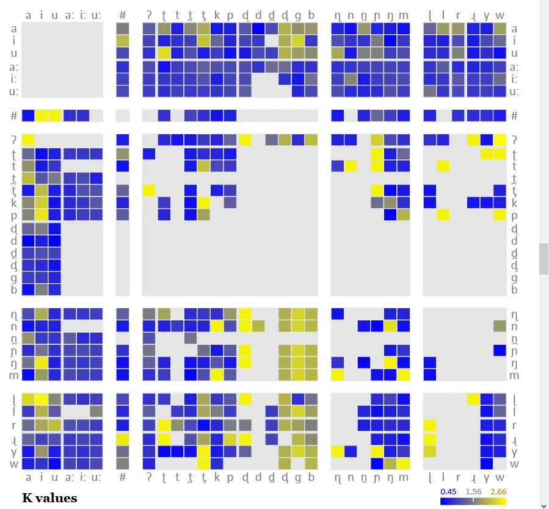
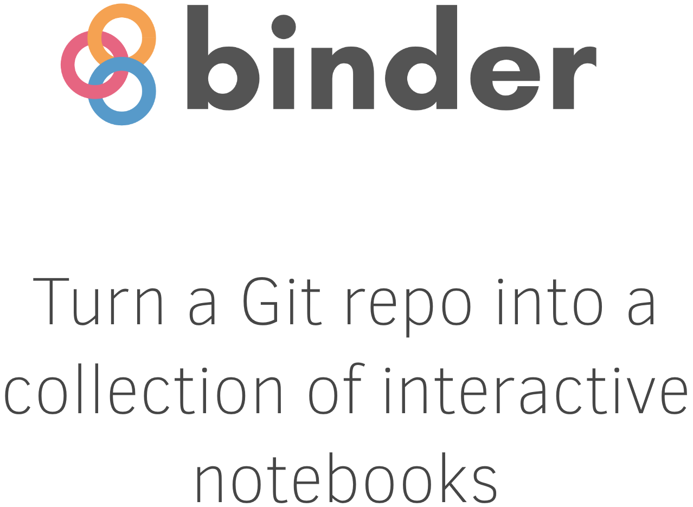

 

```{r news1, echo=FALSE, out.width= "40%", out.extra='style="float:right; padding:10px"'}

```

<br> 

Keep up to date with the current developments at LADAL!

Below you will find information on and links to the latest developments at LADAL such as updates to the LADAL website, upcoming workshops and presentations, planned events, and links to resources. 

<br> <br>

***

# ANNOUNCEMENTS{-}

***

### 2020/10/09: VARIENG - LADAL becomes more Finlandish{-}


```{r varieng, echo=FALSE, out.width= "35%", out.extra='style="float:right; padding:10px"'}
knitr::include_graphics("images/varieng.png")
```
  
The [VARIENG](https://www.helsinki.fi/en/researchgroups/varieng) at the [University of Helsinki](https://www.helsinki.fi/en) has agreed to affiliate with LADAL! VARIENG is a perfect affiliate due to the similarity in the outlook and the alignment of aims of both VARIENG and LADAL. In addition, we are super happy to have VARIENG as an affiliate institution because of their extremely high scientific merit!


### 2020/10/07: DDL expertism and Phylolygisms{-}

```{r clust, echo=FALSE, out.width= "20%", out.extra='style="float:right; padding:10px"'}

```

[Erich Round](https://researchers.uq.edu.au/researcher/1761) - director of the *Ancient Languages Lab* and world-reknowned phylogenetics expert as well as recipient of the [British Academy Global Professorship](https://languages-cultures.uq.edu.au/article/2020/07/dr-erich-round-awarded-british-academy-global-professorship) - is now officially a contributor to LADAL! His expertise in R and phylogentics fantastically complement our skill set here and we are more than going crazy for having him on board!

<br><br><br>

```{r ddl, echo=FALSE, out.width= "20%", out.extra='style="float:right; padding:10px"'}

```

Also - and on an equally enthusiastic note - [Peter Crosthwaite](http://researchers.uq.edu.au/researcher/18390), the foremost proponent on Data Driven Learning in Australia, has agreed to be a LADAL affiliate! Peter is not only a fantastic  second language acquisition scholar but he has probably one of the best overviews of existing software in this domain and is amazingly well versed in finding the right applications to do awesome research!

Welcome on board!

<br>

### 2020/10/05: Big in Japan{-}

```{r japan, echo=FALSE, out.width= "20%", out.extra='style="float:right; padding:10px"'}

```

Laurence Anthony - [the royal highness of AntConc empire](https://www.laurenceanthony.net/software/antconc/) - has agreed to be an affiliate of LADAL! We are so glad to have him on board as Laurence is not only tech savvy as few others in Corpus Linguistics but also because Laurence is overall wholesome and a fantastic promoter of computation in HASS research!

<br>

### 2020/10/02: Library Excellence!{-}

Stephane Guillou has agreed to be a contributor and affiliate of LADAL! That is really fantastic not only because Stephane is all-around awesome and a true R wiz but Stephane is also directing the upskilling efforts in R, Python, and Git at the UQ library and thus brings along a fantastic skill-set!

<br>


### 2020/09/29: Syndey Corpus Lab collab!{-}

```{r scl, echo=FALSE, out.width= "40%", out.extra='style="float:right; padding:10px"'}
knitr::include_graphics("images/scl.png")
```

[Monika Bednarek](https://www.sydney.edu.au/arts/about/our-people/academic-staff/monika-bednarek.html) who is running the [Sydney Corpus Lab](https://sydneycorpuslab.com/) at the University of Sydney, has agreed to be an affiliate member of LADAL. This is perfect for LADAL given Monika's expertise and excellent research in Corpus Linguistics as well as the close alignment of the Sydney Corpus Lab with LADAL!

<br>

### 2020/09/25: LADAL goes Finland!{-}

```{r finland, echo=FALSE, out.width= "25%", out.extra='style="float:right; padding:10px"'}
knitr::include_graphics("images/reindeer.jpg")
```

The news that LADAL exists has reached the other side of the globe: Martin was invited by [Mikko Laitinen from the University of Eastern Finland](https://uefconnect.uef.fi/en/person/mikko.laitinen/) to give a guest lecture about his experiences in establishing LADAL in the context of an event about developing support infrastructures for computational social sciences and humanities research.

<br><br>

```{r pressure, echo=FALSE, out.width= "25%", out.extra='style="float:right; padding:10px"'}

```

### 2020/09/22: Interaction!{-}

We have decided to include interactive exercises into our tutorials and we are currently looking into different options how to achieve this. Currently [Binder](https://mybinder.org/) appears to be a viable pathway forward. 


### 2020/09/15: They multiply!{-}

We are delighted to announce that Katy McHugh, Stephen Clark, and Restuadi Restuadi have joined the LADAL team!

Katy, Stephen, and Restuadi will be involved in the restructuring, professionalizing, and revamping the LADAL webpage. We would like to extend our warmest welcome to them and express our gratutude to the School of Languages and Cultures at UQ for providing the funding for the RA positions.

```{r staff, echo=FALSE, out.width= "95%", out.extra='style="float:centre; padding:10px"'}
knitr::include_graphics("images/katyrestustephen.png")
```


***

# RESOURCES, WORKSHOPS & PRESENTATIONS{-}

***

Below are links to additional resources, workshops, and presentations. 

### Workshop materials{-}

Check out the materials of previous workshops:

```{r ws3, echo=FALSE, out.width= "20%", out.extra='style="float:left; padding:15px"'}

```

+ [Getting started with R for (absolute) beginners](file:///D:/Uni/UQ/SLC/LADAL/SLCLADAL.github.io/IntroR_workshop.html): This workshop focused on why you should use R, what you can do with R, and how you can use it for your data analysis. 


+ [Statistics – Analyzing Survey and Questionnaire Data](file:///D:/Uni/UQ/SLC/LADAL/SLCLADAL.github.io/surveys.html): This workshop introduced basic visualizations and statistical tests for analyzing survey and questionnaire data. 

+ [Happy Computer, Happy Me!](file:///D:/Uni/UQ/SLC/LADAL/SLCLADAL.github.io/introcomputer.html): This workshop shows ways to keep your computer happy and your data clean by providing simple tips and tricks for computer maintenance that keep your computer running at optimum speed and reliability. 


***

[Main page](https://slcladal.github.io/index.html)

