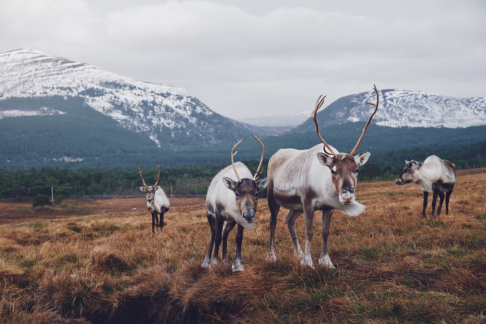

 

```{r news1, echo=FALSE, out.width= "40%", out.extra='style="float:right; padding:10px"'}
knitr::include_graphics("images/news.jpg")
```

<br> 

Keep up to date with the current developments at LADAL!

Below you will find information on and links to the latest developments at LADAL such as updates to the LADAL website, upcoming workshops and presentations, planned events, and links to resources. 

<br> <br>

***

# ANNOUNCEMENTS{-}

***

### 2/10/2020: Library Excellence!{-}

Stephane Guillou has agreed to be a contributor and affiliate of LADAL! That is really fantastic not only because Stephane is all-around awesome and a true R wiz but Stephane is also directing the upskilling efforts in R, Python, and Git at the UQ library and thus brings along a fantastic skill-set! 
<br>

```{r finland, echo=FALSE, out.width= "25%", out.extra='style="float:right; padding:10px"'}

```

### 25/9/2020: LADAL goes Finland!{-}

The news that LADAL exists has reached the other side of the globe: Martin was invited by Mikko Laitinen from the University of Eastern Finland to give a guest lecture about his experiences in establishing LADAL in the context of an event about developing support infrastructures for computational social sciences and humanities research.

<br>

```{r pressure, echo=FALSE, out.width= "25%", out.extra='style="float:right; padding:10px"'}
knitr::include_graphics("images/binder.png")
```

### 2020/09/22: Interaction!{-}

We have decided to include interactive exercises into our tutorials and we are currently looking into different options how to achieve this. Currently [Binder](https://mybinder.org/) appears to be a viable pathway forward. 


### 2020/09/15: They multiply!{-}

We are delighted to announce that Katy McHugh, Stephen Clark, and Restuadi Restuadi have joined the LADAL team!

Katy, Stephen, and Restuadi will be involved in the restructuring, professionalizing, and revamping the LADAL webpage. We would like to extend our warmest welcome to them and express our gratutude to the School of Languages and Cultures at UQ for providing the funding for the RA positions.

```{r staff, echo=FALSE, out.width= "95%", out.extra='style="float:centre; padding:10px"'}
knitr::include_graphics("images/katyrestustephen.png")
```


***

# RESOURCES, WORKSHOPS & PRESENTATIONS{-}

***

Below are links to additional resources, workshops, and presentations. 

### Workshop materials{-}

Check out the materials of previous workshops:

```{r ws3, echo=FALSE, out.width= "20%", out.extra='style="float:left; padding:15px"'}
knitr::include_graphics("images/happycomputer.png")
```

+ [Getting started with R for (absolute) beginners](file:///D:/Uni/UQ/SLC/LADAL/SLCLADAL.github.io/IntroR_workshop.html): This workshop focused on why you should use R, what you can do with R, and how you can use it for your data analysis. 


+ [Statistics – Analyzing Survey and Questionnaire Data](file:///D:/Uni/UQ/SLC/LADAL/SLCLADAL.github.io/surveys.html): This workshop introduced basic visualizations and statistical tests for analyzing survey and questionnaire data. 

+ [Happy Computer, Happy Me!](file:///D:/Uni/UQ/SLC/LADAL/SLCLADAL.github.io/introcomputer.html): This workshop shows ways to keep your computer happy and your data clean by providing simple tips and tricks for computer maintenance that keep your computer running at optimum speed and reliability. 


***

[Main page](https://slcladal.github.io/index.html)

