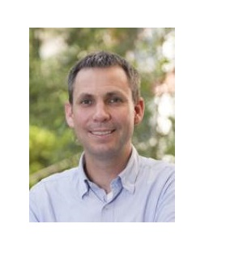
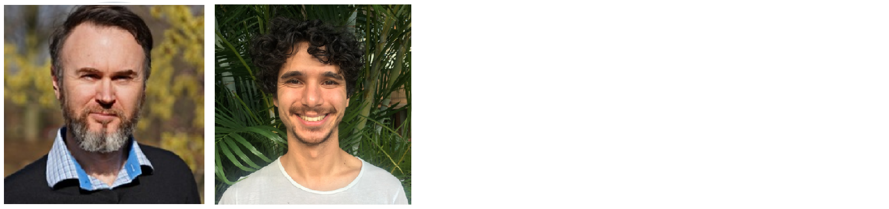

```{r slc, echo=FALSE, out.width= "45%", out.extra='style="float:right; padding:10px"'}

```

<br>

The LADAL is a collaborative effort that is sponsored by the [School of Languages and Cultures](https://languages-cultures.uq.edu.au/) at the [University of Queensland](https://www.uq.edu.au/). If you are interested in becoming an affiliate member or even a contributor contact the LADAL team via email (ladal\@uq.edu.au).

<br>

***

# DIRECTORS{-}


[Martin Schweinberger](https://languages-cultures.uq.edu.au/profile/4295/martin-schweinberger)

```{r martin, echo=FALSE, out.width= "30%", out.extra='style="float:left; padding:10px"'}
knitr::include_graphics("images/martinschweinberger.jpeg")
```

<br> 

+ Martin has initiated and established LADAL, and is its leading proponent.

+ His role at LADAL encompasses creating content, supervising team members, and directing the activities at LADAL

+ He is currently a postdoctoral research fellow in Language Technology with a PhD in English linguistics at the School of Languages and Cultures

+ He is a language data scientist  specialized in corpus linguistics, quantitative analyses, computational modeling, and visualization of linguistic data. 

Martin's research focuses on language variation and change, determinants of language use and linguistic variability, as well as language acquisition.  
  

[Michael Haugh ](https://languages-cultures.uq.edu.au/profile/1498/michael-haugh)

```{r michael, echo=FALSE, out.width= "30%", out.extra='style="float:left; padding:10px"'}

```

<br>

+ Michael is supervising its activities and promoting LADAL and its activities across Australia 


+ He is Professor of Linguistics and Head of the School of Languages and Cultures

+ He is a long-standing proponent of Digital Humanities in Australia with a special focus on data management and accessibility and usability of language data

Michael's research interests lie primarily in the field of pragmatics, with a focus on analyzing face, (im)politeness, teasing and humor, indirectness, and intention. He has been involved in the establishment of the [Australian National Corpus](http://www.ausnc.org.au), and is interested in further developing methods in corpus-assisted pragmatics.  
  
***

# STAFF{-}  

In addition to the directors, the LADAL staff consists of researchers or research assistants from various backgrounds, e.g. statistics, web design, and software development, who are employed to assist and contribute to LADAL.

```{r staff, echo=FALSE, out.width= "95%", out.extra='style="float:centre; padding:10px"'}
knitr::include_graphics("images/katyrestustephen.png")
```

&nbsp;&nbsp;&nbsp;&nbsp;&nbsp;&nbsp;&nbsp;&nbsp;&nbsp;&nbsp;&nbsp;&nbsp;&nbsp;&nbsp;&nbsp;&nbsp;[Katy McHugh](https://www.linkedin.com/in/katymchugh/?originalSubdomain=au) &nbsp;&nbsp;&nbsp;&nbsp;&nbsp;&nbsp;&nbsp;&nbsp;&nbsp;&nbsp;&nbsp;&nbsp;&nbsp;&nbsp;&nbsp;&nbsp;&nbsp;&nbsp;&nbsp;&nbsp;&nbsp;&nbsp;&nbsp;&nbsp;&nbsp; [Restuadi Restuadi](https://github.com/restuadi311) &nbsp;&nbsp;&nbsp;&nbsp;&nbsp;&nbsp;&nbsp;&nbsp;&nbsp;&nbsp;&nbsp;&nbsp;&nbsp;&nbsp;&nbsp;&nbsp;&nbsp;&nbsp; [Stephen Kennedy-Clark](https://www.linkedin.com/in/stephenkclark/?originalSubdomain=au) &nbsp;&nbsp;&nbsp;&nbsp;&nbsp;&nbsp;&nbsp;&nbsp;&nbsp;&nbsp;&nbsp;&nbsp;&nbsp;&nbsp;&nbsp;&nbsp;&nbsp;&nbsp;&nbsp;

***

# CONTRIBUTORS{-}

Contributors are actively engaged in the LADAL and assist in the development of LADAL infrastructure or resources.

```{r staff2, echo=FALSE, out.width= "95%", out.extra='style="float:centre; padding:10px"'}

```

&nbsp;&nbsp;&nbsp;&nbsp;&nbsp;&nbsp;&nbsp;&nbsp;&nbsp;&nbsp;&nbsp;&nbsp;&nbsp;&nbsp;&nbsp;&nbsp;&nbsp;&nbsp;&nbsp;&nbsp;&nbsp;[Erich Round](https://researchers.uq.edu.au/researcher/1761) &nbsp;&nbsp;&nbsp;&nbsp;&nbsp;&nbsp;&nbsp;&nbsp;&nbsp;&nbsp;&nbsp;&nbsp;&nbsp;&nbsp;&nbsp;&nbsp;&nbsp;&nbsp;&nbsp;&nbsp;&nbsp;&nbsp;&nbsp;&nbsp;[Stephane Guillou](https://gitlab.com/stragu)
 

```{r contributors, echo=FALSE, out.width= "95%", out.extra='style="float:centre; padding:10px"'}

```

&nbsp;&nbsp;&nbsp;&nbsp;&nbsp;&nbsp;&nbsp;&nbsp;&nbsp;&nbsp;&nbsp;&nbsp;&nbsp;&nbsp;&nbsp;&nbsp;[Katy McHugh](https://www.linkedin.com/in/katymchugh/?originalSubdomain=au) &nbsp;&nbsp;&nbsp;&nbsp;&nbsp;&nbsp;&nbsp;&nbsp;&nbsp;&nbsp;&nbsp;&nbsp;&nbsp;&nbsp;&nbsp;&nbsp;&nbsp;&nbsp;&nbsp;&nbsp;&nbsp;&nbsp;&nbsp;&nbsp;&nbsp; [Restuadi Restuadi](https://github.com/restuadi311) &nbsp;&nbsp;&nbsp;&nbsp;&nbsp;&nbsp;&nbsp;&nbsp;&nbsp;&nbsp;&nbsp;&nbsp;&nbsp;&nbsp;&nbsp;&nbsp;&nbsp;&nbsp; [Stephen Kennedy-Clark](https://www.linkedin.com/in/stephenkclark/?originalSubdomain=au) &nbsp;&nbsp;&nbsp;&nbsp;&nbsp;&nbsp;&nbsp;&nbsp;&nbsp;&nbsp;&nbsp;&nbsp;&nbsp;&nbsp;&nbsp;&nbsp;&nbsp;&nbsp;&nbsp;&nbsp;&nbsp;&nbsp;&nbsp;&nbsp;&nbsp; [Liam Crowhurst](https://www.linkedin.com/in/liam-crowhurst-3aaa56121/?originalSubdomain=au)  


***
 
# AFFILIATE MEMBERS{-}

Affiliate members support the LADAL and are informed about events, workshops, and training opportunities at LADAL.

[Erich Round](https://researchers.uq.edu.au/researcher/1761) (The University of Queensland, Australia)

[Gerold Schneider](https://www.cl.uzh.ch/de/people/team/compling/gschneid.html) (University of Zurich, Switzerland)

[Monika Bednarek](https://www.sydney.edu.au/arts/about/our-people/academic-staff/monika-bednarek.html) (University of Sydney, Australia)

[Laurence Anthony](https://www.laurenceanthony.net/) (Waseda University, Japan)

[Peter Crosthwaite](http://researchers.uq.edu.au/researcher/18390) (The University of Queensland, Australia)

[Stephane Guillou](https://gitlab.com/stragu) (The University of Queensland, Australia)

***

# COLLABORATING INSTITUTIONS/ORGANIZATIONS{-}

Collaborating institutions and organizations support LADAL and share information or resources with LADAL.

```{r alc, echo=FALSE, out.width= "30%", out.extra='style="float:left; padding:10px"'}

```
  
<br>

The [School of Languages and Cultures](https://languages-cultures.uq.edu.au/) at the [University of Queensland](https://www.uq.edu.au/)

<br><br>

```{r tcc, echo=FALSE, out.width= "30%", out.extra='style="float:left; padding:10px"'}

```
  
<br>

The [Text Crunching Center](https://www.cl.uzh.ch/en/TCC.html) at the [University of Zurich (UZH)](https://www.uzh.ch/en.html)
  
<br><br><br><br>

```{r scl, echo=FALSE, out.width= "30%", out.extra='style="float:left; padding:10px"'}
knitr::include_graphics("images/scl.png")
```

<br>

The [Sydney Corpus Lab](https://sydneycorpuslab.com/) at [The University of Sydney](https://www.sydney.edu.au/) 

<br><br>


```{r varieng, echo=FALSE, out.width= "30%", out.extra='style="float:left; padding:10px"'}

```
  
<br>

[VARIENG](https://www.helsinki.fi/en/researchgroups/varieng) at the [University of Helsinki](https://www.helsinki.fi/en)

<br><br>

***

# FORMER MEMBERS{-}

Former members were engaged with LADAL but have taken up new positions, changed affiliations, or moved institutions resulting in parting trajectories.

[Katherine Dallaston](https://kjdallaston.com/)

***

[Main page](https://slcladal.github.io/index.html)

