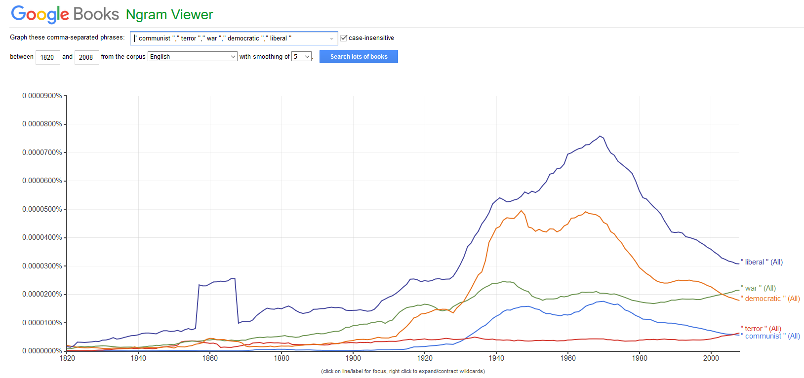
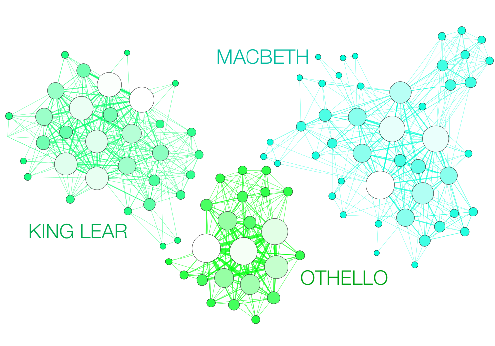
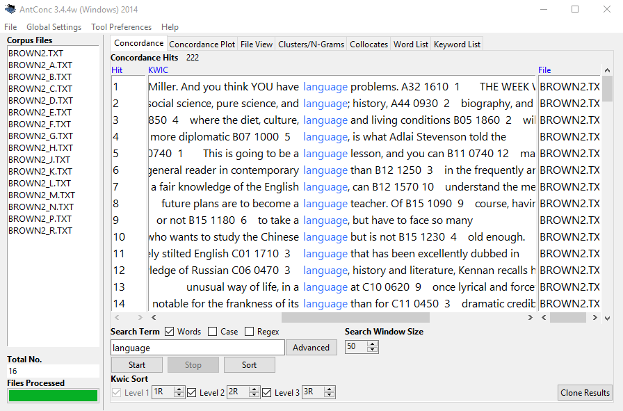

```{r uq1, echo=F, eval = T, fig.cap="", message=FALSE, warning=FALSE, out.width='100%'}
knitr::include_graphics("images/uq1.jpg")
```

# Introduction{-}

This tutorial introduces Text Analysis [see @bernard1998text; @kabanoff1997introduction; @popping2000computer], i.e. computer-based analysis of language data or the (semi-)automated extraction of information from text. The entire code for the sections below can be downloaded [here](https://slcladal.github.io/textanalysis.Rmd). 

Since Text Analysis extracts and analyses information from language data, it can be considered a derivative of computational linguistics or an application of *Natural Language Processing* (NLP) to HASS research. As such, Text Analysis represents the application of computational methods in the humanities.

The advantage of Text Analysis over manual or traditional techniques (close reading) lies in the fact that Text Analysis allows the extraction of information from large sets of textual data and in a replicable manner. Other terms that are more or less synonymous with Text Analysis are Text Mining, Text Analytics, and Distant Reading. In some cases, Text Analysis is considered more qualitative while Text Analytics is considered to be quantitative. This distinction is not taken up here as Text Analysis, while allowing for qualitative analysis, builds upon quantitative information, i.e. information about frequencies or conditional probabilities. 

```{r ngram, echo=FALSE, out.width= "35%", out.extra='style="float:right; padding:10px"'}

```

Distant Reading is a cover term for applications of Text Analysis that allow to investigate literary and cultural trends using text data. Distant Reading contrasts with close reading, i.e. reading texts in the traditional sense whereas Distant Reading refers to the analysis of large amounts of text. Text Analysis and distant reading are similar with respect to the methods that are used but different with respect to their outlook. The outlook of distant reading is to extract information from text without close reading, i.e. reading the document(s) itself but rather focusing on emerging patterns in the language that is used. 

Text Analysis or Distant Reading are rapidly growing in use and gaining popularity in the humanities because textual data is readily available and because computational methods can be applied to a huge variety of research questions. The attractiveness of computational text analysis is thus based on the availability of (large amounts of) digitally available texts and in their capability to provide insights that cannot be derived from close reading techniques. 


```{r shakespeare, echo=FALSE, out.width= "60%", out.extra='style="float:right; padding:10px"'}

```

While rapidly growing as a valid approach to analysing textual data, Text Analysis is [critizised](https://www.chronicle.com/article/The-Digital-Humanities-Debacle/245986)  for lack of "quantitative rigor and because its findings are either banal or, if interesting, not statistically robust (see [here](https://www.chronicle.com/article/The-Digital-Humanities-Debacle/245986). This criticism is correct in that most of the analysis that performed in *Computational Literary Studies* (CLS) are not yet as rigorous as analyses in fields that have a longer history of computational based, quantitative research, such as, for instance, corpus linguistics. However, the practices and methods used in CLS will be refined, adapted and show a rapid increase in quality if more research is devoted to these approaches. Also, Text Analysis simply offers an alternative way to analyse texts that is not in competition to traditional techniques but rather complements them.

Given it relatively recent emergence, so far, most of the applications of Text Analysis are based upon a relatively limited number of key procedures or concepts (e.g. concordancing, word frequencies, annotation or tagging, parsing, collocation, text classification, Sentiment Analysis, Entity Extraction, Topic Modelling, etc.). In the following, we will explore these procedures and introduce some basic tools that help you perform the introduced tasks. 

## Text Analysis at UQ{-}

The [UQ Library](https://www.library.uq.edu.au/) offers a very handy and attractive summary of [resources, concepts, and tools](https://guides.library.uq.edu.au/research-techniques/text-mining-analysis/introduction) that can be used by researchers interested in Text Analysis and Distant Reading. Also, the UQ library site offers short video introductions and addresses issues that are not discussed here such as [copyright issues](https://guides.library.uq.edu.au/research-techniques/text-mining-analysis/considerations), [data sources available at the UQ library](https://guides.library.uq.edu.au/research-techniques/text-mining-analysis/sources-of-text-data), as well as [social media](https://guides.library.uq.edu.au/research-techniques/text-mining-analysis/sources-of-text-data) and [web scaping](https://guides.library.uq.edu.au/research-techniques/text-mining-analysis/web-scraping).

In contrast to the UQ library site, the focus of this introduction lies on the practical how-to of text analysis. this means that the following concentrates on how to perform analyses rather than discussing their underlying concepts or evaluating their scientific merits. 

## Tools versus Scripts{-}

It is perfectly fine to use tools for the analyses exemplified below. However, the aim here is not primarily to show how to perform text analyses but how to perfrom text analyses in a way that complies with practices that guarantee sustainable, transparent, reproducible research. As R code can be readily shared and optimally contains all the data extraction, processing, vizualization, and analysis steps, using scripts is preferable over using (commercial) software. 

In addition to being not as transparent and hindering reproduction of research, using tools can also lead to dependencies on third parties which does not arise when using open source software. 

Finally, the widespread use of "R" particularly among data scientists, engineers, and analysts reduces the risk of software errors as a very active community corrects flawed functions typically quite rapidly. 

## Preparation and session set up{-}


This tutorial is based on R. If you have not installed R or are new to it, you will find an introduction to and more information how to use R [here](https://slcladal.github.io/IntroR_workshop.html). For this tutorials, we need to install certain *packages* from an R *library* so that the scripts shown below are executed without errors. Before turning to the code below, please install the packages by running the code below this paragraph. If you have already installed the packages mentioned below, then you can skip ahead ignore this section. To install the necessary packages, simply run the following code - it may take some time (between 1 and 5 minutes to install all of the libraries so you do not need to worry if it takes some time).

```{r prep1, echo=T, eval = F, message=FALSE, warning=FALSE}
# clean current workspace
rm(list=ls(all=T))
# set options
options(stringsAsFactors = F)
# install libraries
install.packages(c("class", "cluster", "dplyr", "factoextra", 
                   "FactoMineR", "ggplot2", "ggraph", "grid", 
                   "gutenbergr", "igraph", "knitr", "Matrix", 
                   "NLP", "openNLP", "openNLPmodels.en", "png", 
                   "stringr", "syuzhet", "tidyr", "tidytext", 
                   "tm", "topicmodels", "wordcloud", "xtable"))
```

Once you have installed R Studio and initiated the session by executing the code shown above, you are good to go.

# Concordancing

In Text Analysis, concordancing refers to the extraction of words from a given text or texts [@lindquist2009corpus]. Commonly, concordances are displayed in the form of key-word in contexts (KWIC)) where the search term is shown with some preceding and following context. Thus, such displays are referred to as key word in context concordances. A more elaborate tutorial on how to perform concordancing with R is available [here](https://slcladal.github.io/kwics.html).

<br>

```{r antconc, echo=FALSE, out.width= "60%", out.extra='style="float:right; padding:10px"'}

```

<br>

Concordancing is helpful for inspecting how often a given word occurs in a text or a collection of texts, for seeing how the term is used in the data, for extracting examples, and it also represents a basic procedure and often the first step in more sophisticated analyses of language data. 

In the following, we will use R to create a KWIC display. More precisely, we will load Charles Darwin's *On the origin of species by means of natural selection* and investigate his use of the phrase *natural selection* in across chapters. 

```{r conc1, echo=T, eval = T, message=FALSE, warning=FALSE}
# load libraries
library(dplyr)
library(stringr)
# read in text
darwin <- readLines("https://slcladal.github.io/data/origindarwin.txt") %>%
  paste(sep = " ", collapse = " ") %>%
  str_replace_all("(CHAPTER [XVI]{1,7}\\.{0,1}) ", "qwertz\\1") %>%
  tolower() %>%  
  strsplit("qwertz") %>%
  unlist()
# inspect data
nchar(darwin)
```

Now that we have the subsections of the data that we aim to investigate, we can perform the concordancing. To create a KWIC display, we load the function `ConcR` from a script called `ConcR_2.3_loadedfiles.R`. Then we define a pattern that we want to look for (the pattern can be a simple word or it contain regular expressions). Then, we define the amount of context that we want to have displayed (in our case 50 characters). Finally, we run the concordance function `ConcR` with the arguments `darwin` (the text elements that we want to inspect), the `search pattern`, and the `context`.

```{r conc3, echo=T, eval = T, message=FALSE, warning=FALSE}
# load function for concordancing
source("https://slcladal.github.io/rscripts/ConcR_2.5_LoadedFiles.R")
# start concordancing
darwinorganism <- ConcR(darwin, "organism[s]{0,1}", 50)
# inspect data
darwinorganism[1:5, 2:ncol(darwinorganism)]
```

We now want to extract the chapter in which the instance has occurred.

```{r conc4, echo=T, eval = T, message=FALSE, warning=FALSE}
# clean data
darwinorganism <- darwinorganism[complete.cases(darwinorganism),]
# determine chapter
darwinorganism$Chapter <- ifelse(grepl("chapter [xvi]{1,7}\\.{0,1} .*", darwinorganism$OriginalString) == T, gsub("(chapter [xvi]{1,7})\\.{0,1} .*", "\\1", darwinorganism$OriginalString), darwinorganism$OriginalString)
# remove OriginalString column 
darwinorganism$OriginalString <- NULL
# inspect data
head(darwinorganism)
```

Now, the KWIC display is finished and we could go about investigating how Darwin has used the term "organism".

# Word Frequency

One basic aspect of Text Analysis consists in extracting word frequency lists, i.e. determining how often word forms occur in a given text or collection of texts. In fact, frequency information lies at the very core of Text Analysis. 

To exemplify how frequency information can help us in an analysis, we will continue working with the KWIC display that we have created above.

In the following, we want to find out about changes in the frequency with which the term "organism" has been used across chapters in Darwin's "Origin". 

In a first step, we extract the number of words in each chapter.

```{r wf1, echo=T, eval = T, message=FALSE, warning=FALSE}
# extract number of words per chapter
library(dplyr)
darwinchapters <- darwin %>%
  strsplit(" ")
words <- sapply(darwinchapters, function(x) length(x))
# inspect data
words
```

Next, we extract the number of matches in each chapter.

```{r wf2, echo=T, eval = T, message=FALSE, warning=FALSE}
# extract number of matches per chapter
library(stringr)
matcheschapters <- darwin %>%
  str_extract_all(., "organism[s]{0,1}") 
matches <- sapply(matcheschapters, function(x) length(x))
# inspect data
matches
```

Now, we extract the names of the chapters and create a table with the chapter names and the relative frequency of matches per 1,000 words.

```{r wf3, echo=T, eval = T, message=FALSE, warning=FALSE}
# extract chapters
Chapters <- as.vector(unlist(sapply(darwin, function(x){
  x <- gsub("(chapter [xvi]{1,7})\\.{0,1} .*", "\\1", x)
  x <- ifelse(nchar(x) > 50, "chapter 0", x)
})))
# calculate rel. freq of serach term per chapter 
Frequency <- matches/words*1000
# create table of results
tb <- data.frame(Chapters, Frequency)
# inspect results
head(tb)
```

We can now visualize the relative frequencies of our search word per chapter.

```{r wf4, echo=T, eval = T, message=FALSE, warning=FALSE}
# load library
library(ggplot2)
# create plot
ggplot(tb, aes(x=Chapters, y=Frequency, group =1)) + 
  geom_smooth(aes(y = Frequency, x = Chapters), color = "goldenrod2")+
  geom_line(aes(y = Frequency, x = Chapters), color = "indianred4") +         
  guides(color=guide_legend(override.aes=list(fill=NA))) +
  theme(axis.text.x = element_text(angle = 45, hjust = 1))+
  scale_y_continuous(name ="Relative Frequency (per 1,000 words)")
```

We will now briefly check an example where we simply extract a frequency list from a corpus.

```{r wf5, echo=T, eval = T, message=FALSE, warning=FALSE}
# load library
library(tm)
# load and process corpus
corpuswords <- readLines("https://slcladal.github.io/data/origindarwin.txt")  %>%
  tolower() %>%
  removeWords(stopwords("english")) %>% 
  str_replace_all("[^[:alpha:][:space:]]*", "")  %>%
  paste(sep = " ", collapse = " ") %>%
  str_replace_all(" {2,}", " ") %>%
  strsplit(" ") %>%
  unlist()  
# create table
wordfreqs <- corpuswords %>%
  table() %>%
  as.data.frame() %>%
  arrange(desc(Freq))
# add column names
colnames(wordfreqs) <- c("Word", "Frequency")
# inspect data
head(wordfreqs)
```

Such word frequency lists can be visualized, for example, as bargraphs.

```{r wf6, echo=T, eval = T, message=FALSE, warning=FALSE}
# prepare data
wfd <- table(corpuswords)
wfd <- wfd[order(wfd, decreasing = T)]
wfd <- wfd[1:10]
# start plot
barplot(wfd, las = 1, ylim = c(0,2000), las=2)
text(seq(0.7, 11.5, 1.2), wfd+150, wfd)
```

Alternatively, word frequency lists can be visualized, although less informative, as word clouds. 

```{r wf7, echo=T, eval = T, message=FALSE, warning=FALSE}
# load library
library("wordcloud")
# create wordcloud
wordcloud(words = wordfreqs$Word, freq = wordfreqs$Frequency, 
          max.words=100, random.order=FALSE, rot.per=0.35, 
          colors=brewer.pal(8, "BrBG"))
```

Word lists can be used to determine differences between texts. For instance, we can load two different texts and check whether they differ with respect to word frequencies.

```{r wf8, echo=T, eval = T, message=FALSE, warning=FALSE}
# load data
orwell <- readLines("https://slcladal.github.io/data/orwell.txt")
melville <- readLines("https://slcladal.github.io/data/melvillemobydick.txt")
# combine each text into one element
orwell <- paste(as.vector(unlist(orwell)), sep = " ", collapse = " ")
melville <- paste(as.vector(unlist(melville)), sep = " ", collapse = " ")
# load libraries
library(tm)
library(dplyr)
library(xtable)
# clean texts
docs <- Corpus(VectorSource(c(orwell, melville))) %>%
  tm_map(removePunctuation) %>%
  tm_map(removeNumbers) %>%
  tm_map(tolower)  %>%
  tm_map(removeWords, stopwords("english")) %>%
  tm_map(stripWhitespace) %>%
  tm_map(PlainTextDocument)
# create term document matrix
tdm <- TermDocumentMatrix(docs) %>%
  as.matrix()
colnames(tdm) <- c("Orwell","Melville")
# create comparison cloud
comparison.cloud(tdm, random.order=FALSE, 
                 colors = c("orange","lightblue"),
                 title.size=2.5, max.words=200, 
                 title.bg.colors = "white")
```

Frequency information can also tell us something about the nature of a text. For instance, private dialogues will typically contain higher rates of second person pronouns compared with more format text types, such as, for instance, scripted monologues like speeches. For this reason, word frequency lists can be used in text classification and to determine the formality of texts.

As an example, below you find the number of the second person pronouns “you” and “your” and the number of all words except for these second person pronouns in private dialogues compared with scripted monologues in the Irish component of the International corpus of English (ICE).

```{r wf9, eval=T, echo=F, message=FALSE, warning=FALSE, paged.print=FALSE}
library(knitr)
numbers <- matrix(c("you, your", "6761", "659", 
"Other words",	"259625",	"105295"), byrow = T, nrow = 2)
colnames(numbers) <- c("", "Private dialogues", "Scripted monologues")
kable(numbers, caption = "", align=c(rep('c',times=2)))
```

If we calculate the percentage of second person pronouns in both text types and see whether private dialogues contain more of these second person pronouns than scripted monologues (i.e. speeches).

```{r wf10, eval=T, echo=F, message=FALSE, warning=FALSE, paged.print=FALSE}
library(knitr)
numbers <- matrix(c("you, your", "6761", "659", 
"Other words",	"259625",	"105295", "Percent",	"2.60",	"0.63"), byrow = T, nrow = 3)
colnames(numbers) <- c("", "Private dialogues", "Scripted monologues")
kable(numbers, caption = "", align=c(rep('c',times=2)))
```

This simple example shows that second person pronouns make up 2.6 percent of all words that are used in private dialogues while they only amount to 0.63 percent in scripted speeches. A handy way to present such differences visually are association and mosaic plots.

```{r wf11, eval=T, echo=T, message=FALSE, warning=FALSE, paged.print=FALSE}
d <- matrix(c(6761, 659, 259625, 105295), nrow = 2, byrow = T)
colnames(d) <- c("D", "M")
rownames(d) <- c("you, your", "Other words")
assocplot(d)
```

Bars above the dashed line indicate relative overuse while bars below the line suggest relative underuse. Therefore, the association plot indicates underuse of "you/your" and overuse of "other words" in monologues while the opposite trends holds true for dialogues, i.e. overuse of "you/your" and underuse of "Other words". 

# Collocations and N-grams

Collocation refers to the co-occurrence of words. A typical example of a collocation is “Merry Christmas” because the words merry and Christmas occur together more frequently together than would be expected by chance, if words were just randomly stringed together.  

N-grams are related to collocates in that they represent words that occur together (bi-grams are two words that occur together, tri-grams three words and so on). Fortunately, creating N-gram lists is very easy. We will use the "Origin" to create a bi-gram list. As a first step, we load the data and split it into individual words.

```{r coll1, eval=T, echo=T, message=FALSE, warning=FALSE, paged.print=FALSE}
# load libraries
library(dplyr)
library(stringr)
library(tm)
# read in text
darwin <- readLines("https://slcladal.github.io/data/origindarwin.txt") %>%
  paste(sep = " ", collapse = " ") %>%
  removePunctuation() %>%
  str_replace_all(" {2,}", " ") %>% 
  tolower() %>%
  strsplit(" ") %>%
  unlist()
# inspect data
head(darwin)
```

```{r coll2, eval=T, echo=T, message=FALSE, warning=FALSE, paged.print=FALSE}
# create data frame
darwindf <- data.frame(darwin[1:length(darwin)-1], 
                       darwin[2:length(darwin)])
# add column names
colnames(darwindf) <- c("Word1", "Word2")
# inspect data
head(darwindf)
```

```{r coll3, eval=T, echo=T, message=FALSE, warning=FALSE, paged.print=FALSE}
# create data frame
darwin2grams <- paste(darwindf$Word1, darwindf$Word2, sep = " ")
# tabulate results
darwin2gramstb <- table(darwin2grams)
# create data frame
darwin2gramsdf <- data.frame(darwin2gramstb)
# order data frame
darwin2gramsdf <- darwin2gramsdf[order(darwin2gramsdf$Freq, decreasing = T),]
# simplify column names
colnames(darwin2gramsdf) <- c("Bigram", "Frequency")
# inspect data
head(darwin2gramsdf)
```

Both N-grams and collocations are not only an important concept in language teaching but they are also fundamental in Text Analysis and many other research areas working with language data. Unfortunately, words that collocate do not have to be immediately adjacent but can also encompass several slots. This is unfortunate because it makes retrieval of collocates substantially more difficult compared with a situation in which we only need to extract words that occur right next to each other.


# Text Classification

Text classification refers to methods that allow to classify a given text to a predefined set of languages, genres, authors, or the like. Such classifications are typically based on the relative frequency of word classes, key words, phonemes, or other linguistic features such as average sentence length, words per line, etc.

As with most other methods that are used in text analysis, text classification typically builds upon a training set that is already annotated with the required tags. Training sets and the features that are derived from these training sets can be created by oneself or one can use build in training sets that are provided in the respective software packages or tools. 

In the following, we will use the frequency of phonemes to classify a text. In a first step, we read in a German text, and split it into phonemes.

```{r tc1, echo=T, eval = T, message=FALSE, warning=FALSE}
# read in German text
German <- readLines("https://slcladal.github.io/data/phonemictext1.txt") %>%
  str_replace_all(" ", "") %>%
  str_split("") %>%
  unlist() %>%
  as.vector()
# inspect data
head(German, 20)
```

We now do the same for three other texts - an English and a Spanish text as well as one text in a language that we will determine using classification.

```{r tc2, echo=T, eval = T, message=FALSE, warning=FALSE}
# read in texts
English <- readLines("https://slcladal.github.io/data/phonemictext2.txt")
Spanish <- readLines("https://slcladal.github.io/data/phonemictext3.txt")
Unknown <- readLines("https://slcladal.github.io/data/phonemictext4.txt")
# clean, split texts into phonemes, unlist and convert them into vectors
English <- as.vector(unlist(strsplit(gsub(" ", "", English), "")))
Spanish <- as.vector(unlist(strsplit(gsub(" ", "", Spanish), "")))
Unknown <- as.vector(unlist(strsplit(gsub(" ", "", Unknown), "")))
# inspect data
head(English, 20)
```

We will now create a table that represents the phonemes and their frequencies in each of the 4 texts. In addition, we will add the language and simply the column names.

```{r tc3, echo=T, eval = T, message=FALSE, warning=FALSE}
# create data tables
German <- data.frame(names(table(German)), as.vector(table(German)))
English <- data.frame(names(table(English)), as.vector(table(English)))
Spanish <- data.frame(names(table(Spanish)), as.vector(table(Spanish)))
Unknown <- data.frame(names(table(Unknown)), as.vector(table(Unknown)))
# add column with language
German$Language <- "German"
English$Language <- "English"
Spanish$Language <- "Spanish"
Unknown$Language <- "Unknown"
# simlify column names
colnames(German)[1:2] <- c("Phoneme", "Frequency")
colnames(English)[1:2] <- c("Phoneme", "Frequency")
colnames(Spanish)[1:2] <- c("Phoneme", "Frequency")
colnames(Unknown)[1:2] <- c("Phoneme", "Frequency")
# comine all tables into a single table
classdata <- rbind(German, English, Spanish, Unknown) 
# inspect table for English
head(classdata)
```

Now, we group the data so that we see, how often each phoneme is used in each language.

```{r tc4, echo=T, eval = T, message=FALSE, warning=FALSE}
# activate package
library(tidyr)
# convert into wide format
classdw <- classdata %>%
  spread(Phoneme, Frequency) %>%
  replace(is.na(.), 0)
# inspect data
head(classdw)
```
Now, we need to transform the data again, so that we have the frequency of each phoneme by language as the classifier will use "Language" as the dependent variable and the phoneme frequencies as predictors.

```{r tc5, echo=T, eval = T, message=FALSE, warning=FALSE}
numvar <- colnames(classdw)[2:length(colnames(classdw))]
classdw[numvar] <- lapply(classdw[numvar], as.numeric)
# function for normalizing numeric variables
normalize <- function(x) { (x-min(x))/(max(x)-min(x))   }
# apply normalization
 classdw[numvar] <- as.data.frame(lapply(classdw[numvar], normalize))
 # inspect data
classdw[, 1:5]
```

Before turning to the actual classification, we will use a cluster analysis to see which texts the unknown text is most similar with.

```{r tc6, echo=T, eval = T, message=FALSE, warning=FALSE}
# remove language column
textm <- classdw[,2:ncol(classdw)]
# add languages as row names
rownames(textm) <- classdw[,1]
# create distance matrix
distmtx <- dist(textm)
# activate library
library("cluster")         # activate library
clustertexts <- hclust(    # hierarchical cluster object
  distmtx,                 # use data diststudents
  method="ward.D")         # ward.D as linkage method
plot(clustertexts,         # plot result as dendrogram
     hang = .25,           # labels at split
     main = "")            # no title
```

According to the cluster analysis, the unknown text clusters together with the English texts which suggests that the unknown text is likely to be English.

Before we begin with the actual classification, we will split the data so that we have one data set without "Unknown" (this is our training set) and one data set with only "Unknown" (this is our test set).

```{r echo=T, eval = T, message=FALSE, warning=FALSE}
#load library
library(dplyr)
# create training set
train <- classdw %>%
  filter(Language != "Unknown")
# increase training set size
#train <- rbind(train, train, train, train, train, train, train, train)
# create test set
test <- classdw %>%
  filter(Language == "Unknown")
# convert variables
#train$Language <- as.factor(train$Language)
#train$Language <- as.factor(train$Language)
# inspect data
train
```

Finally, we can apply our classifier to our data. The classifier we use is a k-nearest neighbour classifier as the underlying function will classify an unknown element given its proximity to the clusters in the training set.

```{r message=FALSE, warning=FALSE}
# activate library
library("class")
# apply k-nearest-neighbor (knn) classifier
prediction <- class::knn(train[,2:ncol(train)], test[,2:ncol(test)], cl = train[, 1], k = 3)
# inspect the result
prediction
```

Based on the frequencies of phonemes in the unknown text, the knn-classifier predicts that the unknown text is English. This is in fact true as the text is a subsection of the Wikipedia article for Aldous Huxley's *Brave New World*. The training texts were German, English, and Spanish translations of a subsection of Wikipedia's article for Hermann Hesse's *Steppenwolf*. 

# Entity Extraction

Entity Extraction is a process during which textual elements which have characteristics that are common to proper nouns (locations, people, organizations, etc.) rather than other parts of speech, e.g. non-sentence initial capitalization, are extracted from texts. Retrieving entities is common in automated summarization and in Topic Modelling. Entity extraction can be achieved by simple feature extraction (e.g. extract all non-sentence initial capitalized words) or with the help of training sets. Using training sets, i.e. texts that are annotated for entities and non-entities, achieves better results when dealing with unknown data and data with inconsistent capitalization.

```{r ee1, echo=T, eval = T, message=FALSE, warning=FALSE}
# load libraries
library(NLP)
library(openNLP)
#library(openNLPmodels.en)
library(openNLPdata)
# load text
orwell <- readLines("https://slcladal.github.io/data/orwell.txt")
orwell <- orwell  %>%
  paste(sep = " ", collapse = " ") %>%
  str_replace_all(" {2,}", " ") %>%
  str_replace_all("Part 2,.*", "")
# convert text into string
orwell = as.String(orwell)
# define annotators
sent_annot = Maxent_Sent_Token_Annotator()
word_annot = Maxent_Word_Token_Annotator()
loc_annot = Maxent_Entity_Annotator(kind = "location") 
people_annot = Maxent_Entity_Annotator(kind = "person") 
# start annotation
orwellanno = NLP::annotate(orwell, list(sent_annot, word_annot, 
                                        loc_annot, people_annot))
# extract features
k <- sapply(orwellanno$features, `[[`, "kind")
# extract locations
orwelllocations = names(table(orwell[orwellanno[k == "location"]]))
# extract people
orwellpeople = names(table(orwell[orwellanno[k == "person"]]))
# inspect extract people
orwellpeople
```

# Citation & Session Info {-}

Schweinberger, Martin. 2020. *Text Analysis and Distant Reading using R*. Brisbane: The University of Queensland. url: https://slcladal.github.io/textanalysis.html (Version 2020.09.27).

```
@manual{schweinberger2020ta,
  author = {Schweinberger, Martin},
  title = {Text Analysis and Distant Reading using R},
  note = {https://slcladal.github.io/textanalysis.html},
  year = {2020},
  organization = "The University of Queensland, Australia. School of Languages and Cultures},
  address = {Brisbane},
  edition = {2020/09/27}
}
```


```{r fin}
sessionInfo()
```

***

[Main page](https://slcladal.github.io/index.html)

***

# References {-}

