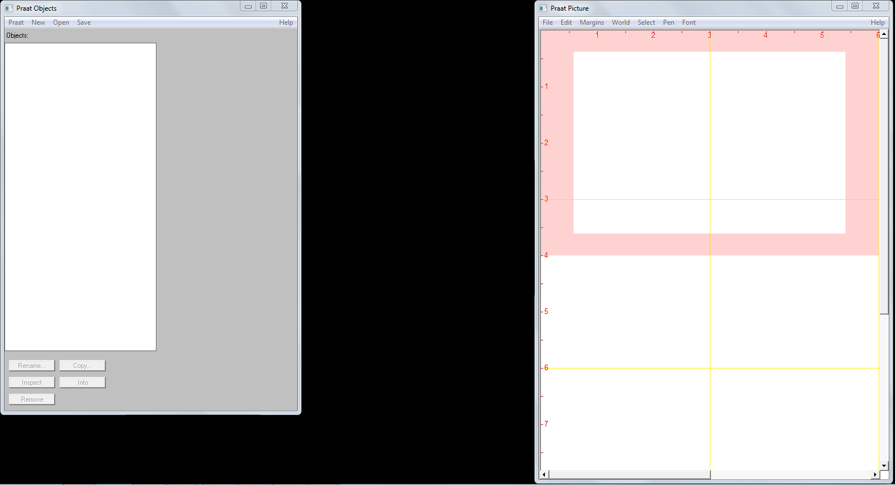
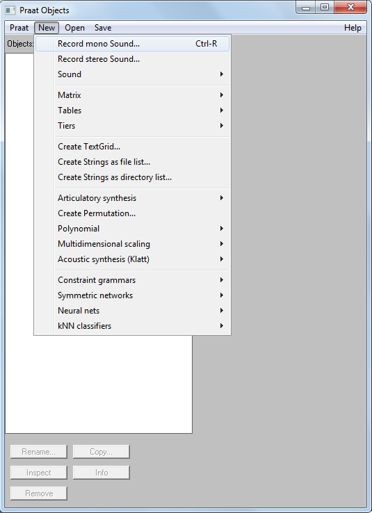
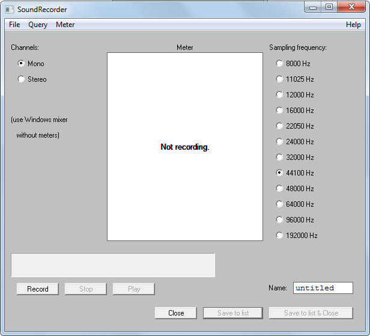
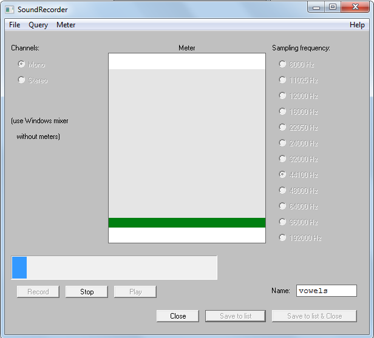
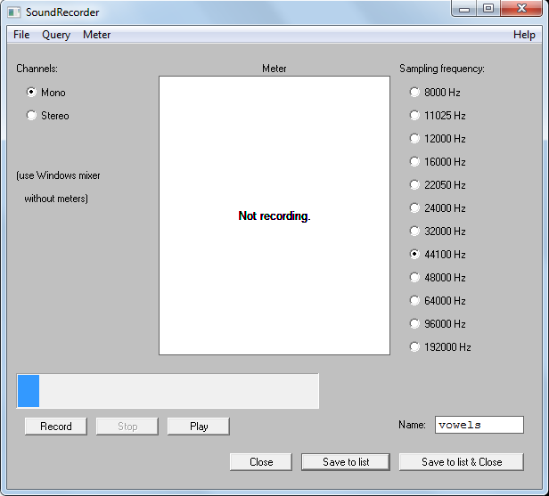
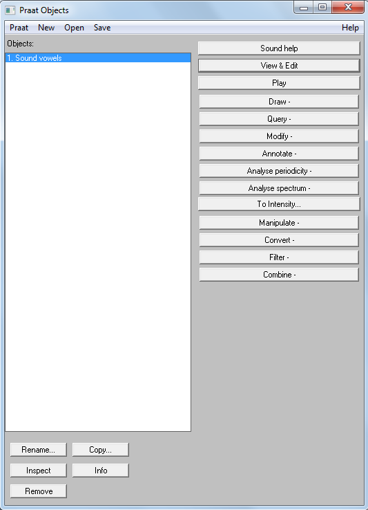
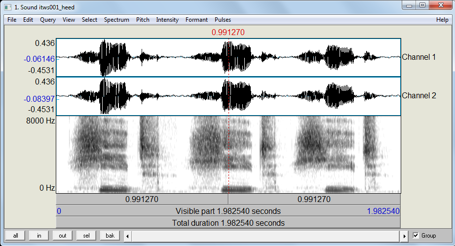
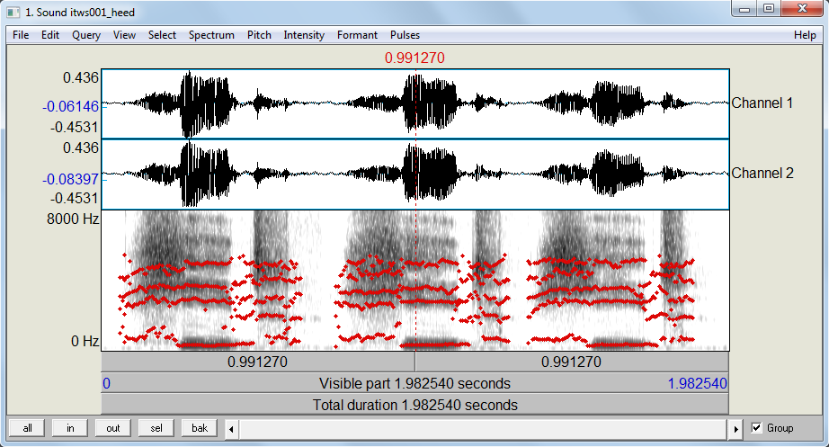
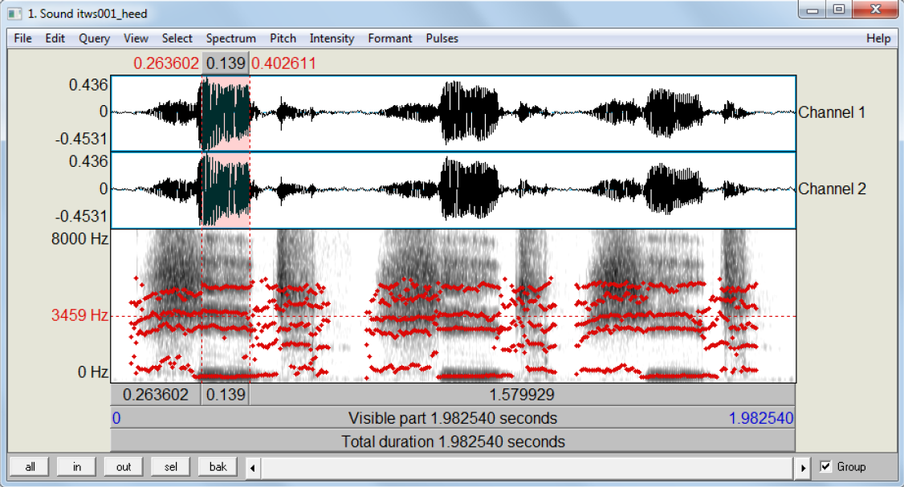
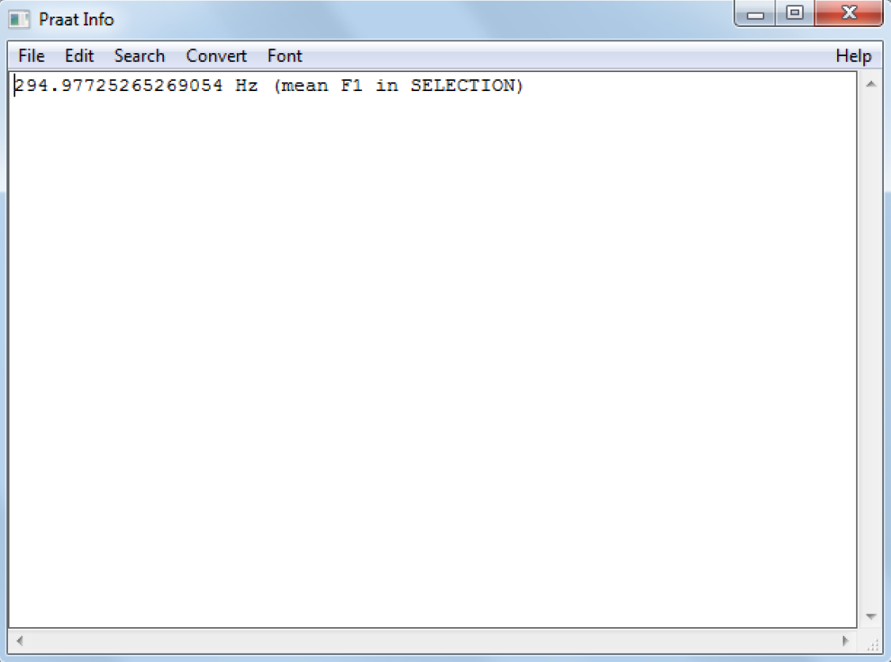

```{r uq1, echo=F, fig.cap="", message=FALSE, warning=FALSE, out.width='100%'}
knitr::include_graphics("images/uq1.jpg")
```

# Introduction{-}

This tutorial exemplifies how to create a vowel chart with Praat and R. The entire R markdown document for this tutoral can be downloaded [here](https://slcladal.github.io/rscripts/vc.Rmd).

When learning or studying a language - the case in point here being English - it is likely that you are confronted with different classes of sounds, e.g. consonants and vowels [@rogers2014sounds]. Consonants differ from vowels in that they are formed with an obstruction of the air stream coming from the lungs and they cannot form the nucleus of a syllable [@zsiga2012sounds]. In fact, consonants are classified according to the manner and place of the obstruction of the air stream. As vowels are produced without obstruction of the air stream, other criteria for differentiating between vowel sounds are needed. The criteria for differentiating between different vowel sounds are 

* the number of tongue positions during vowel production (to differentiate between mono-, diph-, and triphthongs),

* height of the tongue, 

* position of the tongue,

* roundedness of the lips. 

The latter two features are used in the production of vowel charts which show where in the mouth the tongue is
located during the production of monophthongal vowel phones. A vowel chart for the monophthongal vowel phones in Received Pronunciation (RP) is shown below.

```{r vcrp, echo=FALSE, out.width= "45%", out.extra='style="float:center; padding:15px"', fig.cap="Figure 1: Vowel Chart of monophthongal vowel sounds in Received Pronunciation (RP) (left); Tongue positions for the vowels /i, e, E, a/ (right)", fig.show='hold',fig.align='center'}
knitr::include_graphics(c("images/vowelchartrp.png","images/vowelstongue.png"))

```


Interestingly, a very similar figure can be created by plotting the Hertz frequency of the first formant of monophthongal vowel sound against the Hertz frequency of second formant minus the Hertz frequency of the first formant of a monophthongal vowel sound. Formants are frequencies of air waves that, if collapsed, form a complex vowel sound [@johnson2011acoustic; @ladefoged1996elements]. In other words, vowels are periodic, i.e. rythmic, compressions and decompressions of air and to create a vowel sound, i.e. a complex periodic wave, one needs to produce several simple periodic waves simultaneously. During acoustic analysis, the complex wave is deconstructed into its component parts, i.e. the simple periodic waves that make up that sound. This means that we do not necessarily have to plot the position of the tongue of a speaker when he or she produces vowels to create a vowel chart but that analyses of audio recordings of words in which vowels occur, can be utilized to plot a personalized vowel chart of a speaker. Such vowel charts can then be used in language learning as corrective feedback [see @paganus2006vowel].


To produce a personalized vowel chart, the following steps are necessary:

1. Install Praat

2. Record words in which all monophthongal vowel sounds of a given variety occur;

3. Measure and extract the first and second formant of each vowel;

4. Visualize the vowel sounds.


The subsequent sections elaborate the above steps. However, before continuing a word of warning is in order. The example focuses on extracting and plotting vowel formants in an easy but also very uncontrolled way. In case vowel formant extraction is part of a proper research project, some additional steps are warranted. For instance, in a *serious* research project, it were necessary to control and reduce environmental noise and to optimize the recording situation, one would have to randomize the test items (words with the required phonetic environment and the respective vowel sounds) and use filler items (words that are not relevant for the analysis proper) in order to avoid participants guessing which items are relevant for the analysis, one would also use text grids in Praat to guarantee replicability instead of the simple measurements we use in the example here, etc. However, in case you are only interested in an approximation of your own vowel production and how native-like it is, the example fulfills its purpose and provides the reader with a step-by-step guide on how to plot your personalized vowel chart.

Downloading and installing PRAAT The first step is thus to download Praat form www.praat.org and to install it on your machine by following the instructions provided on the website and by the Praat installation script. Praat is an open{source software for acoustic analysis that was developed by Paul Boersma at the University of Amsterdam. 

After having installed Praat we need to record the words in which the monophthongal vowel phones occur. In this example, we will simply record the words shown below.


```{r, echo = F}
ipa_symbols<- c("\u00E6 ", # had
                "\u0251 ", # hard
                "e", # head
                "i", # heed
                "\u025C ", # herd
                "\u026A ", # hid
                "\u0254 ", # hoard
                "\u0252 ", # hod
                "\u028A ", # hood
                "\u028C ", # hud
                "u" # whod
)
phonemic_context <- rep("h_d", length(ipa_symbols))
word <- c("had", "hard", "head", "heed", "herd", "hid", "hoard", "hod", "hood", "hud", "who'd")
ipas <- data.frame(word, ipa_symbols, phonemic_context)
library(DT)
datatable(ipas, rownames = FALSE, filter="none", options = list(pageLength = 11, scrollX=T),
          caption = "Table 1: Word selection with controlled environments in which monophthongal vowels occur")
```

The following section describes how to record data in Praat [see @styler2013using for a more elaborate description of how this can be done].

# Recording words in PRAAT

To record these words, start Praat with a double click on the Praat symbol which - after intstallation - appears on your Desktop. Two windows will appear: the main `object` window to the left and the picture window
to the right (cf. Figure 2). Close the picture window on the right and choose `New` from the menu at the top of the main object window and select `Record mono sound` from the menu which pops up. For the recording it is,
of course, necessary that a microphone is hook up to your machine { the better the microphone, the better the recording and thus the more accurate the graphical display we are going to produce.

```{r praatmain, echo=FALSE, out.width= "95%", out.extra='style="float:center; padding:15px"', fig.cap="Figure 2: Praat's main object window (left) and Praat's picture window (right)"}

```


Selecting `Record mono sound` opens Praat's `SoundRecorder` window (cf. Figure 4). Select `Record`, label the recording by entering a title, e.g. `vowels`, in the `Name` field and read the words form the list shown in Table .

```{r praatmain2, echo=FALSE, out.width= "65%", out.extra='style="float:center; padding:15px"', fig.cap="Figure 3: Praat's main object window"}

```


```{r praatrec, echo=FALSE, out.width= "65%", out.extra='style="float:center; padding:15px"', fig.cap="Figure 4: Praat's recording window"}

```


Each word should be repeated at least three times with a short break between the individual items so that what you record is *had*, *had*, *had* ... pause ... *hard*, *hard*, *hard*, etc. Try to sound natural, i.e. avoid speaking too fast or too slow, and try not to sound artificial or too careful.

While recording, there should be some green bouncing up and down in the vertical white \Meter" stripe (no bouncing indicates that your machine is not recording properly from the microphone).Once you are finished with your recording, select `Stop` and next select `Save to list & close` (cf. Figure 8).

```{r praatdurrec, echo=FALSE, out.width= "65%", out.extra='style="float:center; padding:15px"', fig.cap="Figure 5: Praat's recording window during recording"}

```


```{r praataftrec, echo=FALSE, out.width= "65%", out.extra='style="float:center; padding:15px"', fig.cap="Figure 6: Praat's recording window after recording"}

```


Saving has created an object in Praat's main object window - in case you have named your recording vowels, the new object will be called `1. Sound vowels` (cf. Figure 7). Before editing the data, it is advisable to save them on your machine. To save the data select the Save option from the upper menu, then select `Save as WAV file...` and navigate to the directory in which you want to save the recorded data.

```{r praatsav, echo=FALSE, out.width= "65%", out.extra='style="float:center; padding:15px"', fig.cap="Figure 7: Praat's main object window with saved object"}

```


```{r praatwav, echo=FALSE, out.width= "65%", out.extra='style="float:center; padding:15px"', fig.cap="Figure 8: Save the recording as a .wav file"}

```


Next, select `View & Edit` in Praat's main menu in the main object window. This will open Praat's edit window (cf. Figure 9) - the object represents a recording of the word *heed* repeated three times for sake of
simplicity.

```{r praatheed0, echo=FALSE, out.width= "95%", out.extra='style="float:center; padding:15px"', fig.cap="Figure 9: Praat's edit window with the word *heed* repeated three times"}

```


After recording and saving the data necessary for the task at hand, we continue by extracting the vowel formants.

# Measure and extract vowel formants

Before extracting of the vowel formants, some parameters need adjusting. In a first step, go to `Formant` from the menu at the top of the edit window and select `Formant settings...`. Next, select the option `Show formant` and then, depending on whether the recording represents a male, a female or a child, adjust the `Maximum formant (Hz)` to 5000 Hz (male), 5500 Hz (female) or up to 8000 Hz (for a child) (cf. http://www.haskins.yale.edu/staff/gafos_ downloads/AcouToyPraat(1).pdf). It may also be necessary to adjust the number of formants that Praat aims to find: the default is 5, but it may be set to any number between 3 and 7 depending on the data. To elaborate, if the formants do not exhibit a regular horizontal pattern but they are somewhat unsteady or the dots are all over the place, try to find the number of formants that provide the best results (i.e. steady horizontal lines).

```{r praatheed1, echo=FALSE, out.width= "95%", out.extra='style="float:center; padding:15px"', fig.cap="Figure 10: Praat's edit window with the word *heed* repeated three times and formants shown"}

```


After having set the parameters, listen to the recording and highlight the section which represents the vowel sound you want to extract the formants from. Highlightling is done by selecting the start and end point of the vowel sound - the beginning and end of the steady line during which the vowel is produced - within the edit window as done for the first of the three instances of *heed* in Figure 11.

```{r praatheed2, echo=FALSE, out.width= "95%", out.extra='style="float:center; padding:15px"', fig.cap="Figure 11: Praat's edit window with the word *heed* repeated three times and formants shown and steady state selected"}

```


The vowel formants can be extracted by going to `Formant` in the edit window and selecting `Get first formant`. Having done so, a window with the mean Hertz frequency of the first formant during the steady state is shown (cf. Figure 12). Please note that you should additionally extract the start and end time of the highlighted section from the display in the edit window.

```{r praatheed3, echo=FALSE, out.width= "95%", out.extra='style="float:center; padding:15px"', fig.cap="Figure 12: The mean Hertz frequency of first formant of the word *heed* during the steady state"}

```


To extract the second (and in case you want to use your data in other analysis also the third formant) simply choose `Get third formant` (and `Get second formant`), note down the Hertz frequencies in a table, and also
note down the start and end time of the steady state. The final table should look like Table below (some columns are removed for sake of simplicity).

```{r data1, echo = F}
item <- c("had", "had", "had", "hard", "hard", "hard", "head", "head", "head", "heed", "heed", "heed", "herd", "herd", "herd", "hid", "hid", "hid", "hoard", "hoard", "hoard", "hod", "hod", "hod", "hood", "hood", "hood", "hud", "hud", "hud", "whod", "whod", "whod")
trial <- rep(1:3, each= length(item)/3)
F1 <- c(717.33607, 743.483462, 720.973991, 734.527473, 832.922804, 797.284207, 610.894333, 722.251868, 625.111709, 263.382964, 301.417588, 286.96557, 532.792463, 537.796188, 524.713714, 451.876599, 417.033045, 410.681731, 540.330631, 549.92048, 648.048222, 698.406882, 615.162079, 751.018999, 431.299339, 404.18844, 470.146946, 646.051365, 622.53022, 749.353953, 346.88118, 353.826456, 366.813688)
F2 <- c(1868.175427, 1903.715225, 1938.69279, 1493.328918, 1407.824706, 1498.206365, 2062.882002, 2130.632179, 2009.65073, 2833.001674, 2745.84707, 2822.598805, 1704.995395, 1819.891642, 1704.232122, 2390.799614, 2483.389953, 2360.038236, 951.144344, 927.095558, 1093.346613, 1144.46685, 1086.447865, 1452.466334, 1478.192998, 1453.1036, 1216.302702, 1700.003028, 1510.451378, 1581.757811, 1013.000682, 1285.834128, 1016.979961)
subject <- rep("ms", length(item))
file <- rep("vowels", length(item))
df1 <- data.frame(file, subject, trial, item, F1, F2)
datatable(df1, rownames = FALSE, filter="none", options = list(pageLength = 10, scrollX=T), caption = "Table 2: Vowel formants extracted from PRAAT")
```

The next section describes how to plot the data and compare the vowels to equivalent vowels produced by native-RP speakers.


# Visualizing the vowel sounds

We will now process the data so that we can plot the F1 against the F2 values by speaker and word. To do this, we load the required packages and the data from the learner (nns) and the native speakers (ns).

```{r loadvd, message = F, warning=F}
# load packages
library(dplyr)
library(vowels)
library(ggplot2)
# load data
ns <- read.table("https://slcladal.github.io/data/rpvowels.txt", header = T, sep = "\t")
nns <- read.table("https://slcladal.github.io/data/vowels.txt", header = T, sep = "\t") %>%
  select(-file)
```

The data of the native speakers, i.e the reference data, is shown below.

```{r refdata1, echo = F}
item <- c("had", "hard", "head", "heed", "herd", "hid", "hoard", "hod", "hood", "hud", "whod")
context <- rep("wordlist", length(item))
subject <- rep("rpspk", length(item))
F1 <- c(916.35, 604.15, 599.95, 276.15, 493.55, 392.85, 391.65, 483.10, 412.85, 658.20, 288.70)
F2 <- c(1473.15, 1040.15, 1925.70, 2337.60, 1372.40, 2174.35, 629.60, 864.90, 1286.65, 1208.05, 1616.30)
F1sd <- c(124.29815, 70.91973, 102.22858, 25.48328, 47.40917, 40.83893, 39.70718, 35.48002, 32.98209, 116.14945, 30.18905)
F2sd <- c(119.43696, 40.06478, 143.60476, 223.42440, 95.94648, 166.85868, 81.19074, 48.49948, 193.69870, 72.51677, 225.73858)
df2 <- data.frame(subject, item, context, F1, F2, F1sd, F2sd)
datatable(df2, rownames = FALSE, filter="none", options = list(pageLength = 10, scrollX=T), caption = "Table 3: Vowel formants of native RP speakers")
```

The reference data is taken from from @hawkins2005rpvowels (see [here](http://journals.cambridge.org/download.php?file=%2F4190_EE11D5A504D77D9E1521391B92C6038D_journals__IPA_IPA35_02_S0025100305002124a.pdf&cover=Y&code=251b5f479e7fd20814e1b68b258da7cd)) and represents the first and second formant for the words *heed*, *hid*, *head*, *had*, *hard*, *hod*, *hoard*, *hood*, *who'd*, *hud*, and *herd* produced by 5 20 to 25 year old L1-speakers of Received Pronunciation.

We now combine the two data sets, rename the `subject` and `item` columns to `Speaker` and `Word`, add a column which holds the ipa symbols of the vowel sounds that the word represent, and we calculate the means of the F1 (`F1_mean`) and F2 (`F2_mean`) by `Word` and `Speaker`.


```{r refdata2, echo = F}
voweldata <- rbind(nns, ns) %>%
  rename(Speaker = subject,
        Word = item) %>%
  mutate(Speaker = ifelse(Speaker == "ms", "Learner", "NS"),
         ipa = case_when(Word == "had" ~ "\u00E6",
                         Word == "hard" ~ "\u0251", 
                         Word == "head" ~ "e", 
                         Word == "heed" ~ "i",  
                         Word == "herd" ~ "\u025C", 
                         Word == "hid" ~ "\u026A", 
                         Word == "hoard" ~ "\u0254",
                         Word == "hod" ~ "\u0252",  
                         Word == "hood" ~ "\u028A",  
                         Word == "hud" ~ "\u028C",  
                         Word == "whod" ~ "u",
                         FALSE ~ "NA")) %>%
  group_by(Speaker, Word) %>%
  mutate(F1_mean = mean(F1),
         F2_mean = mean(F2)) %>%
  select(-trial)
datatable(voweldata, rownames = FALSE, filter="none", options = list(pageLength = 10, scrollX=T), caption = "Table 2: Vowel formants extracted from PRAAT")
```

We can now generate the vowel chart by plotting the F1 values against the F2 values. In addition, we will differentiate between different vowel sounds as well as between the learner (Learner) and native speakers (NS).

```{r, warning=F, message=F}
ns <- voweldata %>% filter(Speaker == "NS")
nns <- voweldata %>% filter(Speaker == "Learner")
ggplot(voweldata, aes(F2, F1, color = Speaker, group = Word, fill = Speaker)) +
  geom_point(alpha = .1) +
  geom_text(data = voweldata, aes(x = F2_mean, y = F1_mean, label = ipa), fontface = "bold")  +
  stat_ellipse(data = ns, level = 0.50, geom = "polygon", alpha = 0.05, aes(fill = Speaker)) +
  stat_ellipse(data = nns, level = 0.95, geom = "polygon", alpha = 0.05, aes(fill = Speaker)) +
  scale_x_reverse(breaks = seq(500, 3000, 500), labels = seq(500, 3000, 500)) + scale_y_reverse() +
  scale_color_manual(breaks = c("Learner", "NS"), values = c("orange", "gray40")) +
  theme_bw() +
  theme(legend.position = "top",
        panel.grid.major = element_blank(), 
        panel.grid.minor = element_blank())
```

The vowel chart shows that the i-sounds by the L1-German speaker are more fronted and that the o-sounds are substantially higher by the non-native speaker compared to the RP reference vowel spaces. The short u-sound, however, is very similar, indicating that this L1-German speaker produces the short u-sound in English very native-like while the long u-sound is higher and more fronted in the speech of the L1-German speaker. Interestingly, the vowel space of the ash differs quite dramatically between the native speakers
and the L1 German speaker which could be caused by the fact that German does not have an ash vowel.
I hope this short tutorial helps you in creating your own personalized vowel charts with Praat and R.


# Citation & Session Info {-}

Schweinberger, Martin. 2020. *Creating Vowel Charts in R*. Brisbane: The University of Queensland. url: https://slcladal.github.io/vc.html (Version 2020.09.29).

```
@manual{schweinberger2020vc,
  author = {Schweinberger, Martin},
  title = {Creating Vowel Charts in R},
  note = {https://slcladal.github.io/vc.html},
  year = {2020},
  organization = "The University of Queensland, Australia. School of Languages and Cultures},
  address = {Brisbane},
  edition = {2020/09/29}
}
```

```{r fin}
sessionInfo()
```


***

[Main page](https://slcladal.github.io/index.html)

***


# References{-}


